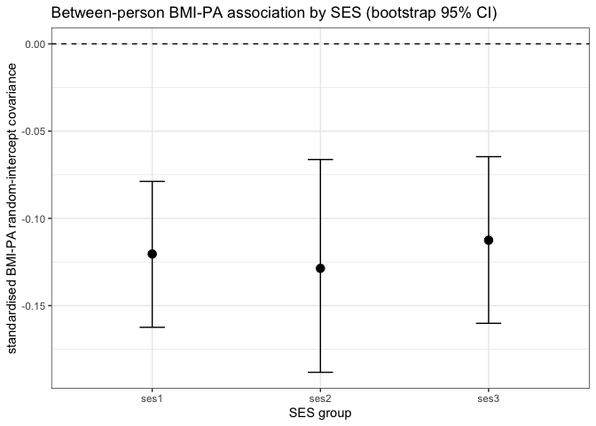

RI-CLPM analysis transcript
================

- [1 data](#1-data)
- [2 analysis steps](#2-analysis-steps)
  - [2.1 equivalised household income](#21-equivalised-household-income)
  - [2.2 per-wave modal income](#22-per-wave-modal-income)
  - [2.3 above-modal income indicator](#23-above-modal-income-indicator)
  - [2.4 recode education into four
    levels](#24-recode-education-into-four-levels)
  - [2.5 highest household education per
    wave](#25-highest-household-education-per-wave)
  - [2.6 derive the three-level SES
    grouping](#26-derive-the-three-level-ses-grouping)
  - [2.7 select analysis columns and
    describe](#27-select-analysis-columns-and-describe)
  - [2.8 wave-scope helper functions](#28-wave-scope-helper-functions)
  - [2.9 rename long-frame columns](#29-rename-long-frame-columns)
  - [2.10 configure the wave scope and
    pivot](#210-configure-the-wave-scope-and-pivot)
  - [2.11 build the wave-pattern view](#211-build-the-wave-pattern-view)
  - [2.12 show the wave-pattern view](#212-show-the-wave-pattern-view)
  - [2.13 physical-activity plausibility
    filter](#213-physical-activity-plausibility-filter)
  - [2.14 select the analysis sample (at least 3 of waves 1 to
    7)](#214-select-the-analysis-sample-at-least-3-of-waves-1-to-7)
  - [2.15 reshape long to wide, one row per
    respondent](#215-reshape-long-to-wide-one-row-per-respondent)
  - [2.16 finalise SES labels and
    columns](#216-finalise-ses-labels-and-columns)
  - [2.17 covariate inclusion flags](#217-covariate-inclusion-flags)
  - [2.18 CLPM model syntax](#218-clpm-model-syntax)
  - [2.19 CLPM syntax with covariates](#219-clpm-syntax-with-covariates)
  - [2.20 RI-CLPM model syntax](#220-ri-clpm-model-syntax)
  - [2.21 RI-CLPM syntax with
    covariates](#221-ri-clpm-syntax-with-covariates)
  - [2.22 fit pooled CLPM](#222-fit-pooled-clpm)
  - [2.23 fit grouped CLPM](#223-fit-grouped-clpm)
  - [2.24 fit grouped CLPM by SES
    group](#224-fit-grouped-clpm-by-ses-group)
  - [2.25 fit grouped CLPM with
    covariates](#225-fit-grouped-clpm-with-covariates)
  - [2.26 fit grouped covariate CLPM by SES
    group](#226-fit-grouped-covariate-clpm-by-ses-group)
  - [2.27 fit pooled RI-CLPM](#227-fit-pooled-ri-clpm)
  - [2.28 fit grouped RI-CLPM](#228-fit-grouped-ri-clpm)
  - [2.29 fit grouped RI-CLPM by SES
    group](#229-fit-grouped-ri-clpm-by-ses-group)
  - [2.30 fit grouped RI-CLPM with
    covariates](#230-fit-grouped-ri-clpm-with-covariates)
  - [2.31 fit grouped covariate RI-CLPM by SES
    group](#231-fit-grouped-covariate-ri-clpm-by-ses-group)
  - [2.32 assemble all model fits](#232-assemble-all-model-fits)
  - [2.33 load lavaan](#233-load-lavaan)
  - [2.34 load minvariance](#234-load-minvariance)
  - [2.35 variables for measurement
    invariance](#235-variables-for-measurement-invariance)
  - [2.36 invariance levels](#236-invariance-levels)
  - [2.37 fit the configural model](#237-fit-the-configural-model)
  - [2.38 extract invariance fit
    statistics](#238-extract-invariance-fit-statistics)
  - [2.39 longitudinal invariance fit
    table](#239-longitudinal-invariance-fit-table)
  - [2.40 invariance parameters to
    compare](#240-invariance-parameters-to-compare)
  - [2.41 across-SES invariance of the within-person
    dynamics](#241-across-ses-invariance-of-the-within-person-dynamics)
  - [2.42 name the SES invariance
    fits](#242-name-the-ses-invariance-fits)
  - [2.43 across-SES invariance: fit by level and the focal structural
    test](#243-across-ses-invariance-fit-by-level-and-the-focal-structural-test)
- [3 result tables](#3-result-tables)
- [4 measurement invariance
  (interpretation)](#4-measurement-invariance-interpretation)
- [5 moderation test](#5-moderation-test)
- [6 RI-CLPM coefficients](#6-ri-clpm-coefficients)
- [7 session information](#7-session-information)

## 1 data

``` r
data_dir <- liss_data_dir()

# seed the long frame from the merged backbone.
liss <- read_liss("liss_merged_long.sav", data_dir = data_dir)

# data provenance: birth times of the merged backbone and the source extracts it
# was assembled from. fall back to modification time on volumes that do not
# record a birth time; missing files surface as NA age.
sav_files <- c(
  "liss_merged_long.sav", "liss_health.sav", "liss_sport.sav",
  "liss_income.sav", "liss_background.sav", "liss_personality.sav"
)
fs::file_info(fs::path(data_dir, sav_files)) %>%
  dplyr::transmute(
    file        = sav_files,
    time_source = ifelse(is.na(birth_time), "modified", "birth"),
    created     = dplyr::coalesce(birth_time, modification_time),
    age_days    = round(as.numeric(difftime(Sys.time(), created, units = "days")))
  ) %>%
  dplyr::arrange(created)
```

    #> # A tibble: 6 × 4
    #>   file                 time_source created             age_days
    #>   <chr>                <chr>       <dttm>                 <dbl>
    #> 1 liss_merged_long.sav birth       2026-07-04 16:37:50        0
    #> 2 liss_health.sav      birth       2026-07-04 16:37:50        0
    #> 3 liss_sport.sav       birth       2026-07-04 16:37:50        0
    #> 4 liss_income.sav      birth       2026-07-04 16:37:50        0
    #> 5 liss_background.sav  birth       2026-07-04 16:37:50        0
    #> 6 liss_personality.sav modified    NA                        NA

## 2 analysis steps

### 2.1 equivalised household income

``` r
liss %<>%
  dplyr::mutate(
    stand_inc = nethh / ((aantalhh - aantalki + 0.8 * aantalki)^0.5)
  )

# cross-check: lissr's weighted_sqrt scale reproduces this equivalisation
if (requireNamespace("lissr", quietly = TRUE)) {
  eq <- lissr::liss_equivalise_income(
    liss$nethh, liss$aantalhh, liss$aantalki, verbose = FALSE
  )
  ok <- is.finite(liss$stand_inc) & is.finite(eq)
  stopifnot(isTRUE(all.equal(liss$stand_inc[ok], eq[ok])))
}
```

### 2.2 per-wave modal income

``` r
liss %<>%
  dplyr::group_by(wavenr) %>%
  dplyr::mutate(
    modaal_per_wave =
      mean(stand_inc, na.rm = TRUE) * 0.79
  ) %>%
  dplyr::ungroup()
```

### 2.3 above-modal income indicator

``` r
liss %<>%
  dplyr::mutate(
    stand_inc_sqrt = sqrt(stand_inc),
    boven_modaal = dplyr::case_when(
      !is.na(stand_inc_sqrt) &
        stand_inc_sqrt < sqrt(modaal_per_wave) ~ 0,
      stand_inc_sqrt >= sqrt(modaal_per_wave) ~ 1,
      TRUE ~ NA_real_
    )
  )
```

### 2.4 recode education into four levels

``` r
liss$oplmet <- type.convert(liss$oplmet, as.is = TRUE)
liss %<>%
  dplyr::mutate(
    educ = dplyr::case_when(
      oplmet == 1 ~ 1, # primary school
      oplmet == 2 ~ 2, # vmbo (intermediate sec. edc.)
      oplmet == 3 ~ 2, # havo/vwo (higher sec./preparatory uni. educ.)
      oplmet == 4 ~ 3, # mbo (intermediate vocational educ.
      oplmet == 5 ~ 4, # hbo (higher vocational educ.)
      oplmet == 6 ~ 4, # wo (university)
      oplmet == 7 ~ 1, # other
      oplmet == 8 ~ 1, # not yet completed any educ.
      oplmet == 9 ~ 1, # not yet started any educ.
      TRUE ~ NA_real_
    )
  )
```

### 2.5 highest household education per wave

``` r
liss %<>%
  dplyr::arrange(wavenr) %>%
  dplyr::group_by(nohouse_encr, wavenr) %>%
  dplyr::mutate(
    highest_educ_in_hh = ifelse(any(!is.na(educ)),
      max(educ, na.rm = TRUE), NA_real_
    )
  ) %>%
  dplyr::ungroup()
```

### 2.6 derive the three-level SES grouping

``` r
liss %<>%
  dplyr::mutate(
    hh_educ_3_groups = dplyr::if_else(
      highest_educ_in_hh == 1, 2,
      highest_educ_in_hh
    ) - 1,
    # ses: household-maximum education in three levels; ses1 to ses3 denote
    # increasing educational attainment
    ses = hh_educ_3_groups
  )
```

### 2.7 select analysis columns and describe

``` r
liss$female <- liss$gender - 1
liss <- liss[c(
  "nomem_encr",
  "wavenr",
  "nohouse_encr",
  "female",
  "ses",
  "boven_modaal",
  "hh_educ_3_groups",
  "hhinc",
  "stand_inc",
  "aantalhh",
  "aantalki",
  "stand_inc_sqrt",
  "modaal_per_wave",
  "highest_educ_in_hh",
  "oplmet",
  "bmi",
  "frve",
  "sport",
  "medicine",
  "smoke",
  "leeftijd"
)]
describe(liss, exclude = c("nomem_encr", "nohouse_encr"))
```

<table style="NAborder-bottom: 0;">

<caption>

Descriptive statistics
</caption>

<thead>

<tr>

<th style="text-align:left;">

</th>

<th style="text-align:center;">

n
</th>

<th style="text-align:center;">

mean
</th>

<th style="text-align:center;">

min
</th>

<th style="text-align:center;">

max
</th>

<th style="text-align:center;">

sd
</th>

<th style="text-align:center;">

skew
</th>

<th style="text-align:center;">

kurtosis
</th>

<th style="text-align:center;">

SE
</th>

<th style="text-align:center;">

Normality
</th>

<th style="text-align:center;">

p
</th>

</tr>

</thead>

<tbody>

<tr>

<td style="text-align:left;">

wavenr
</td>

<td style="text-align:center;">

65156
</td>

<td style="text-align:center;">

7.012
</td>

<td style="text-align:center;">

1.000
</td>

<td style="text-align:center;">

13.000
</td>

<td style="text-align:center;">

3.660
</td>

<td style="text-align:center;">

-0.011
</td>

<td style="text-align:center;">

-1.183
</td>

<td style="text-align:center;">

0.014
</td>

<td style="text-align:center;">

0.097
</td>

<td style="text-align:center;">

\<0.001
</td>

</tr>

<tr>

<td style="text-align:left;">

female
</td>

<td style="text-align:center;">

65156
</td>

<td style="text-align:center;">

0.531
</td>

<td style="text-align:center;">

0.000
</td>

<td style="text-align:center;">

1.000
</td>

<td style="text-align:center;">

0.499
</td>

<td style="text-align:center;">

-0.123
</td>

<td style="text-align:center;">

-1.985
</td>

<td style="text-align:center;">

0.002
</td>

<td style="text-align:center;">

—
</td>

<td style="text-align:center;">

—
</td>

</tr>

<tr>

<td style="text-align:left;">

ses
</td>

<td style="text-align:center;">

65156
</td>

<td style="text-align:center;">

2.139
</td>

<td style="text-align:center;">

1.000
</td>

<td style="text-align:center;">

3.000
</td>

<td style="text-align:center;">

0.852
</td>

<td style="text-align:center;">

-0.268
</td>

<td style="text-align:center;">

-1.570
</td>

<td style="text-align:center;">

0.003
</td>

<td style="text-align:center;">

—
</td>

<td style="text-align:center;">

—
</td>

</tr>

<tr>

<td style="text-align:left;">

boven_modaal
</td>

<td style="text-align:center;">

65156
</td>

<td style="text-align:center;">

0.627
</td>

<td style="text-align:center;">

0.000
</td>

<td style="text-align:center;">

1.000
</td>

<td style="text-align:center;">

0.484
</td>

<td style="text-align:center;">

-0.526
</td>

<td style="text-align:center;">

-1.723
</td>

<td style="text-align:center;">

0.002
</td>

<td style="text-align:center;">

—
</td>

<td style="text-align:center;">

—
</td>

</tr>

<tr>

<td style="text-align:left;">

hh_educ_3_groups
</td>

<td style="text-align:center;">

65156
</td>

<td style="text-align:center;">

2.139
</td>

<td style="text-align:center;">

1.000
</td>

<td style="text-align:center;">

3.000
</td>

<td style="text-align:center;">

0.852
</td>

<td style="text-align:center;">

-0.268
</td>

<td style="text-align:center;">

-1.570
</td>

<td style="text-align:center;">

0.003
</td>

<td style="text-align:center;">

—
</td>

<td style="text-align:center;">

—
</td>

</tr>

<tr>

<td style="text-align:left;">

hhinc
</td>

<td style="text-align:center;">

65156
</td>

<td style="text-align:center;">

50686.072
</td>

<td style="text-align:center;">

1363.000
</td>

<td style="text-align:center;">

483661.038
</td>

<td style="text-align:center;">

35058.310
</td>

<td style="text-align:center;">

2.121
</td>

<td style="text-align:center;">

10.609
</td>

<td style="text-align:center;">

137.345
</td>

<td style="text-align:center;">

0.111
</td>

<td style="text-align:center;">

\<0.001
</td>

</tr>

<tr>

<td style="text-align:left;">

stand_inc
</td>

<td style="text-align:center;">

65156
</td>

<td style="text-align:center;">

23901.532
</td>

<td style="text-align:center;">

626.021
</td>

<td style="text-align:center;">

241830.519
</td>

<td style="text-align:center;">

12093.308
</td>

<td style="text-align:center;">

1.605
</td>

<td style="text-align:center;">

6.624
</td>

<td style="text-align:center;">

47.377
</td>

<td style="text-align:center;">

0.094
</td>

<td style="text-align:center;">

\<0.001
</td>

</tr>

<tr>

<td style="text-align:left;">

aantalhh
</td>

<td style="text-align:center;">

65156
</td>

<td style="text-align:center;">

2.581
</td>

<td style="text-align:center;">

1.000
</td>

<td style="text-align:center;">

9.000
</td>

<td style="text-align:center;">

1.307
</td>

<td style="text-align:center;">

0.830
</td>

<td style="text-align:center;">

0.238
</td>

<td style="text-align:center;">

0.005
</td>

<td style="text-align:center;">

0.282
</td>

<td style="text-align:center;">

\<0.001
</td>

</tr>

<tr>

<td style="text-align:left;">

aantalki
</td>

<td style="text-align:center;">

65156
</td>

<td style="text-align:center;">

0.803
</td>

<td style="text-align:center;">

0.000
</td>

<td style="text-align:center;">

7.000
</td>

<td style="text-align:center;">

1.125
</td>

<td style="text-align:center;">

1.237
</td>

<td style="text-align:center;">

0.890
</td>

<td style="text-align:center;">

0.004
</td>

<td style="text-align:center;">

0.360
</td>

<td style="text-align:center;">

\<0.001
</td>

</tr>

<tr>

<td style="text-align:left;">

stand_inc_sqrt
</td>

<td style="text-align:center;">

65156
</td>

<td style="text-align:center;">

150.032
</td>

<td style="text-align:center;">

25.020
</td>

<td style="text-align:center;">

491.763
</td>

<td style="text-align:center;">

37.309
</td>

<td style="text-align:center;">

0.476
</td>

<td style="text-align:center;">

1.139
</td>

<td style="text-align:center;">

0.146
</td>

<td style="text-align:center;">

0.049
</td>

<td style="text-align:center;">

\<0.001
</td>

</tr>

<tr>

<td style="text-align:left;">

modaal_per_wave
</td>

<td style="text-align:center;">

65156
</td>

<td style="text-align:center;">

18882.210
</td>

<td style="text-align:center;">

17709.177
</td>

<td style="text-align:center;">

20649.212
</td>

<td style="text-align:center;">

867.311
</td>

<td style="text-align:center;">

0.447
</td>

<td style="text-align:center;">

-0.866
</td>

<td style="text-align:center;">

3.398
</td>

<td style="text-align:center;">

0.152
</td>

<td style="text-align:center;">

\<0.001
</td>

</tr>

<tr>

<td style="text-align:left;">

highest_educ_in_hh
</td>

<td style="text-align:center;">

65156
</td>

<td style="text-align:center;">

3.093
</td>

<td style="text-align:center;">

1.000
</td>

<td style="text-align:center;">

4.000
</td>

<td style="text-align:center;">

0.934
</td>

<td style="text-align:center;">

-0.521
</td>

<td style="text-align:center;">

-0.977
</td>

<td style="text-align:center;">

0.004
</td>

<td style="text-align:center;">

—
</td>

<td style="text-align:center;">

—
</td>

</tr>

<tr>

<td style="text-align:left;">

oplmet
</td>

<td style="text-align:center;">

65156
</td>

<td style="text-align:center;">

3.856
</td>

<td style="text-align:center;">

1.000
</td>

<td style="text-align:center;">

9.000
</td>

<td style="text-align:center;">

1.604
</td>

<td style="text-align:center;">

0.167
</td>

<td style="text-align:center;">

-0.540
</td>

<td style="text-align:center;">

0.006
</td>

<td style="text-align:center;">

0.157
</td>

<td style="text-align:center;">

\<0.001
</td>

</tr>

<tr>

<td style="text-align:left;">

bmi
</td>

<td style="text-align:center;">

65156
</td>

<td style="text-align:center;">

25.528
</td>

<td style="text-align:center;">

15.278
</td>

<td style="text-align:center;">

62.500
</td>

<td style="text-align:center;">

4.335
</td>

<td style="text-align:center;">

1.043
</td>

<td style="text-align:center;">

2.476
</td>

<td style="text-align:center;">

0.017
</td>

<td style="text-align:center;">

0.065
</td>

<td style="text-align:center;">

\<0.001
</td>

</tr>

<tr>

<td style="text-align:left;">

frve
</td>

<td style="text-align:center;">

65156
</td>

<td style="text-align:center;">

1.907
</td>

<td style="text-align:center;">

1.000
</td>

<td style="text-align:center;">

3.000
</td>

<td style="text-align:center;">

0.712
</td>

<td style="text-align:center;">

0.136
</td>

<td style="text-align:center;">

-1.024
</td>

<td style="text-align:center;">

0.003
</td>

<td style="text-align:center;">

—
</td>

<td style="text-align:center;">

—
</td>

</tr>

<tr>

<td style="text-align:left;">

sport
</td>

<td style="text-align:center;">

65156
</td>

<td style="text-align:center;">

2.381
</td>

<td style="text-align:center;">

0.000
</td>

<td style="text-align:center;">

157.000
</td>

<td style="text-align:center;">

3.342
</td>

<td style="text-align:center;">

5.509
</td>

<td style="text-align:center;">

135.225
</td>

<td style="text-align:center;">

0.013
</td>

<td style="text-align:center;">

0.238
</td>

<td style="text-align:center;">

\<0.001
</td>

</tr>

<tr>

<td style="text-align:left;">

medicine
</td>

<td style="text-align:center;">

65156
</td>

<td style="text-align:center;">

0.908
</td>

<td style="text-align:center;">

0.000
</td>

<td style="text-align:center;">

5.000
</td>

<td style="text-align:center;">

1.140
</td>

<td style="text-align:center;">

1.200
</td>

<td style="text-align:center;">

0.718
</td>

<td style="text-align:center;">

0.004
</td>

<td style="text-align:center;">

0.287
</td>

<td style="text-align:center;">

\<0.001
</td>

</tr>

<tr>

<td style="text-align:left;">

smoke
</td>

<td style="text-align:center;">

65156
</td>

<td style="text-align:center;">

0.173
</td>

<td style="text-align:center;">

0.000
</td>

<td style="text-align:center;">

1.000
</td>

<td style="text-align:center;">

0.378
</td>

<td style="text-align:center;">

1.732
</td>

<td style="text-align:center;">

1.000
</td>

<td style="text-align:center;">

0.001
</td>

<td style="text-align:center;">

—
</td>

<td style="text-align:center;">

—
</td>

</tr>

<tr>

<td style="text-align:left;">

leeftijd
</td>

<td style="text-align:center;">

65156
</td>

<td style="text-align:center;">

50.753
</td>

<td style="text-align:center;">

16.000
</td>

<td style="text-align:center;">

103.000
</td>

<td style="text-align:center;">

17.535
</td>

<td style="text-align:center;">

-0.170
</td>

<td style="text-align:center;">

-0.856
</td>

<td style="text-align:center;">

0.069
</td>

<td style="text-align:center;">

0.059
</td>

<td style="text-align:center;">

\<0.001
</td>

</tr>

</tbody>

<tfoot>

<tr>

<td style="padding: 0; " colspan="100%">

<span style="font-style: italic;">Note: </span> <sup></sup> Normality:
Lilliefors (Kolmogorov-Smirnov) Test
</td>

</tr>

</tfoot>

</table>

### 2.8 wave-scope helper functions

``` r
check_scope <- function(kill = FALSE) {
  # checks that scope exists
  if (!exists("weasel_env", globalenv(), mode = "environment")) {
    msg <- paste(
      "No scope has been set. Please use the", dQuote("scope()"),
      "function to define a scope before proceeding."
    )
    if (kill) stop(msg, call. = FALSE)
    return(FALSE)
  }
  return(TRUE)
}
create_scope <- function(data,
                         id,
                         wave,
                         size = NULL,
                         lower = NULL,
                         upper = NULL,
                         gap = 0,
                         n_gap = 0,
                         override = TRUE) {
  # create analysis scope
  scope_exists <- check_scope(kill = FALSE)
  if (scope_exists & !override) {
    yes <- utils::askYesNo("Override current scope?")
  } else {
    yes <- TRUE
  }
  if (yes) {
    mget(names(formals()), envir = environment()) %>%
      list2env() %>%
      assign(x = "weasel_env", envir = globalenv())
  }
}

if_null_then <- function(x, new) {
  # replace NULL with default value
  if (length(x) == 0 || is.null(x)) {
    new
  } else {
    x
  }
}

bounds_to_seq <- function(x) {
  # create sequence from range
  range(x, na.rm = TRUE) %>%
    sequence(nvec = diff(.) + 1)
}

eval_scope <- function() {
  # evaluate scope parameters
  with(weasel_env, {
    bounds <- bounds_to_seq(data[[wave]])
    size %<>% `[`(. >= 3) %<>%
      if_null_then(3:max(bounds, na.rm = TRUE))
    lower %<>% if_null_then(head(bounds, 1))
    upper %<>% if_null_then(tail(bounds, 1))
    n_gap <- ifelse(gap > 0, 1, 0)
  })
}

make_set <- function() {
  # generate all wave combinations
  check_scope(kill = TRUE)
  with(weasel_env, {
    set <- lapply(size, combn,
      x = c(lower:upper), simplify = FALSE
    ) %>%
      unlist(recursive = FALSE)
  })
}

as_string <- function(x, na.rm = FALSE) {
  # collapse vector to space-separated string
  `if`(na.rm, x[!is.na(x)], x) %>%
    unlist() %>%
    paste0(collapse = " ")
}

as_sequence <- function(x) {
  # convert string to numeric sequence
  if (is.character(x)) {
    suppressWarnings(as.numeric(strsplit(x, " ")[[1]]))
  } else {
    x
  }
}

gap_to_na <- function(x) {
  # replace missing values with NA
  x[match(bounds_to_seq(x), x, nomatch = NA)]
}

complete_seq <- function(x) {
  # replace missing values in sequence to make it complete
  s <- as_sequence(x)
  bounds_to_seq(s) -> r
  lapply(list(replace(
    r,
    which(is.na(s)), NA
  ), s), paste0, collapse = " ") %>%
    Reduce(f = identical) %>%
    `if`(r, s)
}

count_gaps <- function(x) {
  # count gaps in a sequence
  g <- rle(is.na(gap_to_na(x)))
  c(gap = max(c(0, g$lengths[g$values])), n_gap = sum(g$values))
}

filter_gaps <- function(s, r) {
  # filter wave combinations by gap criteria
  x <- count_gaps(s)
  if ((x[1] <= r[1]) && (x[2] <= r[2])) {
    return(gap_to_na(s))
  }
}

filter_set <- function() {
  # filter wave combinations
  with(weasel_env, {
    refs <- c(gap, n_gap)
    set <- Filter(lapply(set, filter_gaps, refs), f = length)
  })
}

max0 <- function(x) {
  # replace 0 with NA
  if (length(x[!is.na(x)]) == 0) NA else max(x, na.rm = TRUE)
}

pivot <- function() {
  # pivot data frame
  check_scope(kill = TRUE)
  cli::cli_alert_info("Gathering data matching scope criteria.")
  with(weasel_env, {
    pivot <- dplyr::select(data, !!id, !!wave) %>%
      tidyr::pivot_wider(names_from = !!wave, values_from = !!wave) %>%
      dplyr::group_split(dplyr::across(!!id), .keep = TRUE) %>%
      purrr::map_df(~ purrr::map_if(.x, is.numeric, max0)) %>%
      `[`(c(1, order(as.numeric(names(.)[-1])) + 1)) %>%
      dplyr::slice(which(rowSums(!is.na(dplyr::select(., -1))) >= 3))
  })
}

build_view <- function() {
  # build summary
  cli::cli_alert_info("Creating summary view.")
  with(weasel_env, {
    p <- pivot[, !colnames(pivot) %in% c(id, "waves")]
    s <- vapply(set, as_string, character(1)) %>% unique()
    pivot$waves <- vapply(asplit(p, 1), as_string, character(1))
    pivot %<>%
      dplyr::rowwise() %>%
      dplyr::mutate(waves = stringr::str_extract_all(waves, s) %>%
        Filter(f = length) %>% list()) %>%
      dplyr::ungroup()

    view <- dplyr::pull(pivot, waves) %>%
      unlist() %>%
      table() %>%
      stack() %>%
      dplyr::mutate(
        n = stringr::str_count(ind, "[0-9]+|NA"),
        ids = values, waves = ind
      ) %>%
      `[`(c("waves", "n", "ids"))

    view %<>% as.data.frame() %>%
      format(width = 5) %>%
      dplyr::arrange(desc(n)) %>%
      data.table::as.data.table()
  })
}

filter_view <- function(n_range = NULL, ids_range = NULL) {
  # filtering view
  filter_data <- function(x, n, ids) {
    .f <- function(x, y, z) {
      dplyr::filter(x, as.numeric(x[[y]]) %in% bounds_to_seq(z))
    }
    `if`(length(n) >= 2, .f(x, "n", n), x) -> v
    `if`(length(ids) >= 2, .f(v, "ids", ids), v)
  }
  fdf <- filter_data(with(weasel_env, view), n_range, ids_range)
  fdf[order(fdf$ids, decreasing = TRUE), ]
}

get_row <- function(i = NULL) {
  # get subset of data for a view row
  if (is.null(i)) {
    cli::cli_alert_warning(
      "No row selected, returning entire view."
    )
    return(weasel_env$view)
  }
  assign("row", ifelse(is.null(i), 1, i),
    envir = get("weasel_env", mode = "environment")
  )
  with(weasel_env, {
    t_to_keep <- stringr::str_squish(
      view[row, waves]
    ) %>% list(as_sequence(.))
    ids_to_keep <- pivot[pivot$waves %>%
      sapply(function(r) any(t_to_keep[[1]] %in% r)), ]$id

    tbl_from_row <- dplyr::filter(
      data,
      id %in% ids_to_keep & t %in% t_to_keep[[2]]
    )
    return(tbl_from_row)
  })
}
```

### 2.9 rename long-frame columns

``` r
liss %<>%
  dplyr::rename(
    id = nomem_encr,
    t = wavenr,
    pa = sport,
    fv = frve,
    female = female,
    age = leeftijd,
    med = medicine
  )
describe(
  liss,
  exclude = c("id", "nohouse_encr"),
  caption = "Descriptive statistics (pooled)"
)
```

<table style="NAborder-bottom: 0;">

<caption>

Descriptive statistics (pooled)
</caption>

<thead>

<tr>

<th style="text-align:left;">

</th>

<th style="text-align:center;">

n
</th>

<th style="text-align:center;">

mean
</th>

<th style="text-align:center;">

min
</th>

<th style="text-align:center;">

max
</th>

<th style="text-align:center;">

sd
</th>

<th style="text-align:center;">

skew
</th>

<th style="text-align:center;">

kurtosis
</th>

<th style="text-align:center;">

SE
</th>

<th style="text-align:center;">

Normality
</th>

<th style="text-align:center;">

p
</th>

</tr>

</thead>

<tbody>

<tr>

<td style="text-align:left;">

t
</td>

<td style="text-align:center;">

65156
</td>

<td style="text-align:center;">

7.012
</td>

<td style="text-align:center;">

1.000
</td>

<td style="text-align:center;">

13.000
</td>

<td style="text-align:center;">

3.660
</td>

<td style="text-align:center;">

-0.011
</td>

<td style="text-align:center;">

-1.183
</td>

<td style="text-align:center;">

0.014
</td>

<td style="text-align:center;">

0.097
</td>

<td style="text-align:center;">

\<0.001
</td>

</tr>

<tr>

<td style="text-align:left;">

female
</td>

<td style="text-align:center;">

65156
</td>

<td style="text-align:center;">

0.531
</td>

<td style="text-align:center;">

0.000
</td>

<td style="text-align:center;">

1.000
</td>

<td style="text-align:center;">

0.499
</td>

<td style="text-align:center;">

-0.123
</td>

<td style="text-align:center;">

-1.985
</td>

<td style="text-align:center;">

0.002
</td>

<td style="text-align:center;">

—
</td>

<td style="text-align:center;">

—
</td>

</tr>

<tr>

<td style="text-align:left;">

ses
</td>

<td style="text-align:center;">

65156
</td>

<td style="text-align:center;">

2.139
</td>

<td style="text-align:center;">

1.000
</td>

<td style="text-align:center;">

3.000
</td>

<td style="text-align:center;">

0.852
</td>

<td style="text-align:center;">

-0.268
</td>

<td style="text-align:center;">

-1.570
</td>

<td style="text-align:center;">

0.003
</td>

<td style="text-align:center;">

—
</td>

<td style="text-align:center;">

—
</td>

</tr>

<tr>

<td style="text-align:left;">

boven_modaal
</td>

<td style="text-align:center;">

65156
</td>

<td style="text-align:center;">

0.627
</td>

<td style="text-align:center;">

0.000
</td>

<td style="text-align:center;">

1.000
</td>

<td style="text-align:center;">

0.484
</td>

<td style="text-align:center;">

-0.526
</td>

<td style="text-align:center;">

-1.723
</td>

<td style="text-align:center;">

0.002
</td>

<td style="text-align:center;">

—
</td>

<td style="text-align:center;">

—
</td>

</tr>

<tr>

<td style="text-align:left;">

hh_educ_3_groups
</td>

<td style="text-align:center;">

65156
</td>

<td style="text-align:center;">

2.139
</td>

<td style="text-align:center;">

1.000
</td>

<td style="text-align:center;">

3.000
</td>

<td style="text-align:center;">

0.852
</td>

<td style="text-align:center;">

-0.268
</td>

<td style="text-align:center;">

-1.570
</td>

<td style="text-align:center;">

0.003
</td>

<td style="text-align:center;">

—
</td>

<td style="text-align:center;">

—
</td>

</tr>

<tr>

<td style="text-align:left;">

hhinc
</td>

<td style="text-align:center;">

65156
</td>

<td style="text-align:center;">

50686.072
</td>

<td style="text-align:center;">

1363.000
</td>

<td style="text-align:center;">

483661.038
</td>

<td style="text-align:center;">

35058.310
</td>

<td style="text-align:center;">

2.121
</td>

<td style="text-align:center;">

10.609
</td>

<td style="text-align:center;">

137.345
</td>

<td style="text-align:center;">

0.111
</td>

<td style="text-align:center;">

\<0.001
</td>

</tr>

<tr>

<td style="text-align:left;">

stand_inc
</td>

<td style="text-align:center;">

65156
</td>

<td style="text-align:center;">

23901.532
</td>

<td style="text-align:center;">

626.021
</td>

<td style="text-align:center;">

241830.519
</td>

<td style="text-align:center;">

12093.308
</td>

<td style="text-align:center;">

1.605
</td>

<td style="text-align:center;">

6.624
</td>

<td style="text-align:center;">

47.377
</td>

<td style="text-align:center;">

0.094
</td>

<td style="text-align:center;">

\<0.001
</td>

</tr>

<tr>

<td style="text-align:left;">

aantalhh
</td>

<td style="text-align:center;">

65156
</td>

<td style="text-align:center;">

2.581
</td>

<td style="text-align:center;">

1.000
</td>

<td style="text-align:center;">

9.000
</td>

<td style="text-align:center;">

1.307
</td>

<td style="text-align:center;">

0.830
</td>

<td style="text-align:center;">

0.238
</td>

<td style="text-align:center;">

0.005
</td>

<td style="text-align:center;">

0.282
</td>

<td style="text-align:center;">

\<0.001
</td>

</tr>

<tr>

<td style="text-align:left;">

aantalki
</td>

<td style="text-align:center;">

65156
</td>

<td style="text-align:center;">

0.803
</td>

<td style="text-align:center;">

0.000
</td>

<td style="text-align:center;">

7.000
</td>

<td style="text-align:center;">

1.125
</td>

<td style="text-align:center;">

1.237
</td>

<td style="text-align:center;">

0.890
</td>

<td style="text-align:center;">

0.004
</td>

<td style="text-align:center;">

0.360
</td>

<td style="text-align:center;">

\<0.001
</td>

</tr>

<tr>

<td style="text-align:left;">

stand_inc_sqrt
</td>

<td style="text-align:center;">

65156
</td>

<td style="text-align:center;">

150.032
</td>

<td style="text-align:center;">

25.020
</td>

<td style="text-align:center;">

491.763
</td>

<td style="text-align:center;">

37.309
</td>

<td style="text-align:center;">

0.476
</td>

<td style="text-align:center;">

1.139
</td>

<td style="text-align:center;">

0.146
</td>

<td style="text-align:center;">

0.049
</td>

<td style="text-align:center;">

\<0.001
</td>

</tr>

<tr>

<td style="text-align:left;">

modaal_per_wave
</td>

<td style="text-align:center;">

65156
</td>

<td style="text-align:center;">

18882.210
</td>

<td style="text-align:center;">

17709.177
</td>

<td style="text-align:center;">

20649.212
</td>

<td style="text-align:center;">

867.311
</td>

<td style="text-align:center;">

0.447
</td>

<td style="text-align:center;">

-0.866
</td>

<td style="text-align:center;">

3.398
</td>

<td style="text-align:center;">

0.152
</td>

<td style="text-align:center;">

\<0.001
</td>

</tr>

<tr>

<td style="text-align:left;">

highest_educ_in_hh
</td>

<td style="text-align:center;">

65156
</td>

<td style="text-align:center;">

3.093
</td>

<td style="text-align:center;">

1.000
</td>

<td style="text-align:center;">

4.000
</td>

<td style="text-align:center;">

0.934
</td>

<td style="text-align:center;">

-0.521
</td>

<td style="text-align:center;">

-0.977
</td>

<td style="text-align:center;">

0.004
</td>

<td style="text-align:center;">

—
</td>

<td style="text-align:center;">

—
</td>

</tr>

<tr>

<td style="text-align:left;">

oplmet
</td>

<td style="text-align:center;">

65156
</td>

<td style="text-align:center;">

3.856
</td>

<td style="text-align:center;">

1.000
</td>

<td style="text-align:center;">

9.000
</td>

<td style="text-align:center;">

1.604
</td>

<td style="text-align:center;">

0.167
</td>

<td style="text-align:center;">

-0.540
</td>

<td style="text-align:center;">

0.006
</td>

<td style="text-align:center;">

0.157
</td>

<td style="text-align:center;">

\<0.001
</td>

</tr>

<tr>

<td style="text-align:left;">

bmi
</td>

<td style="text-align:center;">

65156
</td>

<td style="text-align:center;">

25.528
</td>

<td style="text-align:center;">

15.278
</td>

<td style="text-align:center;">

62.500
</td>

<td style="text-align:center;">

4.335
</td>

<td style="text-align:center;">

1.043
</td>

<td style="text-align:center;">

2.476
</td>

<td style="text-align:center;">

0.017
</td>

<td style="text-align:center;">

0.065
</td>

<td style="text-align:center;">

\<0.001
</td>

</tr>

<tr>

<td style="text-align:left;">

fv
</td>

<td style="text-align:center;">

65156
</td>

<td style="text-align:center;">

1.907
</td>

<td style="text-align:center;">

1.000
</td>

<td style="text-align:center;">

3.000
</td>

<td style="text-align:center;">

0.712
</td>

<td style="text-align:center;">

0.136
</td>

<td style="text-align:center;">

-1.024
</td>

<td style="text-align:center;">

0.003
</td>

<td style="text-align:center;">

—
</td>

<td style="text-align:center;">

—
</td>

</tr>

<tr>

<td style="text-align:left;">

pa
</td>

<td style="text-align:center;">

65156
</td>

<td style="text-align:center;">

2.381
</td>

<td style="text-align:center;">

0.000
</td>

<td style="text-align:center;">

157.000
</td>

<td style="text-align:center;">

3.342
</td>

<td style="text-align:center;">

5.509
</td>

<td style="text-align:center;">

135.225
</td>

<td style="text-align:center;">

0.013
</td>

<td style="text-align:center;">

0.238
</td>

<td style="text-align:center;">

\<0.001
</td>

</tr>

<tr>

<td style="text-align:left;">

med
</td>

<td style="text-align:center;">

65156
</td>

<td style="text-align:center;">

0.908
</td>

<td style="text-align:center;">

0.000
</td>

<td style="text-align:center;">

5.000
</td>

<td style="text-align:center;">

1.140
</td>

<td style="text-align:center;">

1.200
</td>

<td style="text-align:center;">

0.718
</td>

<td style="text-align:center;">

0.004
</td>

<td style="text-align:center;">

0.287
</td>

<td style="text-align:center;">

\<0.001
</td>

</tr>

<tr>

<td style="text-align:left;">

smoke
</td>

<td style="text-align:center;">

65156
</td>

<td style="text-align:center;">

0.173
</td>

<td style="text-align:center;">

0.000
</td>

<td style="text-align:center;">

1.000
</td>

<td style="text-align:center;">

0.378
</td>

<td style="text-align:center;">

1.732
</td>

<td style="text-align:center;">

1.000
</td>

<td style="text-align:center;">

0.001
</td>

<td style="text-align:center;">

—
</td>

<td style="text-align:center;">

—
</td>

</tr>

<tr>

<td style="text-align:left;">

age
</td>

<td style="text-align:center;">

65156
</td>

<td style="text-align:center;">

50.753
</td>

<td style="text-align:center;">

16.000
</td>

<td style="text-align:center;">

103.000
</td>

<td style="text-align:center;">

17.535
</td>

<td style="text-align:center;">

-0.170
</td>

<td style="text-align:center;">

-0.856
</td>

<td style="text-align:center;">

0.069
</td>

<td style="text-align:center;">

0.059
</td>

<td style="text-align:center;">

\<0.001
</td>

</tr>

</tbody>

<tfoot>

<tr>

<td style="padding: 0; " colspan="100%">

<span style="font-style: italic;">Note: </span> <sup></sup> Normality:
Lilliefors (Kolmogorov-Smirnov) Test
</td>

</tr>

</tfoot>

</table>

### 2.10 configure the wave scope and pivot

``` r
# create a scope environment to define parameters
create_scope(
  data = liss,
  id = "id", # column name for unique subject IDs
  wave = "t", # column name for time/wave indicator
  gap = 0, # maximum allowed gap between waves
  size = 7, # range of number of waves per subject (id)
  upper = 11, # upper bound on wave number
  override = TRUE # override any existing scope environment
)

eval_scope()
```

    #> Warning in sequence.default(., nvec = diff(.) + 1): length(nvec) 1 < 2 = max(length(from), length(by)) -- future R`s default
    #> 'recycle = TRUE' will recycle 'nvec'

``` r
make_set()
filter_set()
pivot()
```

    #> ℹ Gathering data matching scope criteria.

### 2.11 build the wave-pattern view

``` r
build_view()
```

    #> ℹ Creating summary view.

### 2.12 show the wave-pattern view

``` r
filter_view()
```

    #>              waves      n    ids
    #>             <AsIs> <AsIs> <AsIs>
    #> 1:   3 4 5 6 7 8 9      7   2616
    #> 2:  4 5 6 7 8 9 10      7   2456
    #> 3:   2 3 4 5 6 7 8      7   2410
    #> 4:   1 2 3 4 5 6 7      7   2396
    #> 5: 5 6 7 8 9 10 11      7   2323

### 2.13 physical-activity plausibility filter

``` r
# set implausible sport hours to missing before the analysis subset, so the
# filter propagates to liss_subset, the wide frame and every analysis-sample
# table. bmi (observed max about 62) and fv (range 1 to 3) were verified within
# range and left unchanged. pa_ceiling is sport hours per week; values above it
# exceed any plausible general-population sport load.
pa_ceiling <- 40
liss %<>% dplyr::mutate(pa = dplyr::if_else(pa > pa_ceiling, NA_real_, pa))
```

### 2.14 select the analysis sample (at least 3 of waves 1 to 7)

``` r
# retain partial respondents: keep everyone observed on at least min_waves of
# the seven analysis waves, so fiml uses all available cases under mar
analysis_waves <- 1:7
min_waves <- 3L
liss_subset <- liss %>%
  dplyr::filter(t %in% analysis_waves) %>%
  dplyr::group_by(id) %>%
  dplyr::filter(sum(!is.na(bmi) | !is.na(fv) | !is.na(pa)) >= min_waves) %>%
  dplyr::ungroup()
save(
  liss_subset,
  file = "liss_subset.RData"
)

describe(liss_subset,
  exclude = c("id", "nohouse_encr"),
  caption = "Descriptive statistics (subset)"
)
```

<table style="NAborder-bottom: 0;">

<caption>

Descriptive statistics (subset)
</caption>

<thead>

<tr>

<th style="text-align:left;">

</th>

<th style="text-align:center;">

n
</th>

<th style="text-align:center;">

mean
</th>

<th style="text-align:center;">

min
</th>

<th style="text-align:center;">

max
</th>

<th style="text-align:center;">

sd
</th>

<th style="text-align:center;">

skew
</th>

<th style="text-align:center;">

kurtosis
</th>

<th style="text-align:center;">

SE
</th>

<th style="text-align:center;">

Normality
</th>

<th style="text-align:center;">

p
</th>

</tr>

</thead>

<tbody>

<tr>

<td style="text-align:left;">

t
</td>

<td style="text-align:center;">

31861
</td>

<td style="text-align:center;">

3.990
</td>

<td style="text-align:center;">

1.000
</td>

<td style="text-align:center;">

7.000
</td>

<td style="text-align:center;">

1.934
</td>

<td style="text-align:center;">

0.015
</td>

<td style="text-align:center;">

-1.166
</td>

<td style="text-align:center;">

0.011
</td>

<td style="text-align:center;">

0.122
</td>

<td style="text-align:center;">

\<0.001
</td>

</tr>

<tr>

<td style="text-align:left;">

female
</td>

<td style="text-align:center;">

31861
</td>

<td style="text-align:center;">

0.530
</td>

<td style="text-align:center;">

0.000
</td>

<td style="text-align:center;">

1.000
</td>

<td style="text-align:center;">

0.499
</td>

<td style="text-align:center;">

-0.120
</td>

<td style="text-align:center;">

-1.986
</td>

<td style="text-align:center;">

0.003
</td>

<td style="text-align:center;">

—
</td>

<td style="text-align:center;">

—
</td>

</tr>

<tr>

<td style="text-align:left;">

ses
</td>

<td style="text-align:center;">

31861
</td>

<td style="text-align:center;">

2.093
</td>

<td style="text-align:center;">

1.000
</td>

<td style="text-align:center;">

3.000
</td>

<td style="text-align:center;">

0.860
</td>

<td style="text-align:center;">

-0.179
</td>

<td style="text-align:center;">

-1.624
</td>

<td style="text-align:center;">

0.005
</td>

<td style="text-align:center;">

—
</td>

<td style="text-align:center;">

—
</td>

</tr>

<tr>

<td style="text-align:left;">

boven_modaal
</td>

<td style="text-align:center;">

31861
</td>

<td style="text-align:center;">

0.629
</td>

<td style="text-align:center;">

0.000
</td>

<td style="text-align:center;">

1.000
</td>

<td style="text-align:center;">

0.483
</td>

<td style="text-align:center;">

-0.532
</td>

<td style="text-align:center;">

-1.717
</td>

<td style="text-align:center;">

0.003
</td>

<td style="text-align:center;">

—
</td>

<td style="text-align:center;">

—
</td>

</tr>

<tr>

<td style="text-align:left;">

hh_educ_3_groups
</td>

<td style="text-align:center;">

31861
</td>

<td style="text-align:center;">

2.093
</td>

<td style="text-align:center;">

1.000
</td>

<td style="text-align:center;">

3.000
</td>

<td style="text-align:center;">

0.860
</td>

<td style="text-align:center;">

-0.179
</td>

<td style="text-align:center;">

-1.624
</td>

<td style="text-align:center;">

0.005
</td>

<td style="text-align:center;">

—
</td>

<td style="text-align:center;">

—
</td>

</tr>

<tr>

<td style="text-align:left;">

hhinc
</td>

<td style="text-align:center;">

31861
</td>

<td style="text-align:center;">

50081.426
</td>

<td style="text-align:center;">

1675.333
</td>

<td style="text-align:center;">

483661.038
</td>

<td style="text-align:center;">

35028.496
</td>

<td style="text-align:center;">

2.546
</td>

<td style="text-align:center;">

15.944
</td>

<td style="text-align:center;">

196.242
</td>

<td style="text-align:center;">

0.109
</td>

<td style="text-align:center;">

\<0.001
</td>

</tr>

<tr>

<td style="text-align:left;">

stand_inc
</td>

<td style="text-align:center;">

31861
</td>

<td style="text-align:center;">

23036.464
</td>

<td style="text-align:center;">

1721.326
</td>

<td style="text-align:center;">

241830.519
</td>

<td style="text-align:center;">

11614.880
</td>

<td style="text-align:center;">

1.767
</td>

<td style="text-align:center;">

9.332
</td>

<td style="text-align:center;">

65.071
</td>

<td style="text-align:center;">

0.098
</td>

<td style="text-align:center;">

\<0.001
</td>

</tr>

<tr>

<td style="text-align:left;">

aantalhh
</td>

<td style="text-align:center;">

31861
</td>

<td style="text-align:center;">

2.648
</td>

<td style="text-align:center;">

1.000
</td>

<td style="text-align:center;">

9.000
</td>

<td style="text-align:center;">

1.315
</td>

<td style="text-align:center;">

0.787
</td>

<td style="text-align:center;">

0.216
</td>

<td style="text-align:center;">

0.007
</td>

<td style="text-align:center;">

0.279
</td>

<td style="text-align:center;">

\<0.001
</td>

</tr>

<tr>

<td style="text-align:left;">

aantalki
</td>

<td style="text-align:center;">

31861
</td>

<td style="text-align:center;">

0.858
</td>

<td style="text-align:center;">

0.000
</td>

<td style="text-align:center;">

7.000
</td>

<td style="text-align:center;">

1.149
</td>

<td style="text-align:center;">

1.154
</td>

<td style="text-align:center;">

0.744
</td>

<td style="text-align:center;">

0.006
</td>

<td style="text-align:center;">

0.348
</td>

<td style="text-align:center;">

\<0.001
</td>

</tr>

<tr>

<td style="text-align:left;">

stand_inc_sqrt
</td>

<td style="text-align:center;">

31861
</td>

<td style="text-align:center;">

147.363
</td>

<td style="text-align:center;">

41.489
</td>

<td style="text-align:center;">

491.763
</td>

<td style="text-align:center;">

36.341
</td>

<td style="text-align:center;">

0.502
</td>

<td style="text-align:center;">

1.425
</td>

<td style="text-align:center;">

0.204
</td>

<td style="text-align:center;">

0.052
</td>

<td style="text-align:center;">

\<0.001
</td>

</tr>

<tr>

<td style="text-align:left;">

modaal_per_wave
</td>

<td style="text-align:center;">

31861
</td>

<td style="text-align:center;">

18173.881
</td>

<td style="text-align:center;">

17709.177
</td>

<td style="text-align:center;">

18831.080
</td>

<td style="text-align:center;">

340.048
</td>

<td style="text-align:center;">

0.510
</td>

<td style="text-align:center;">

-0.536
</td>

<td style="text-align:center;">

1.905
</td>

<td style="text-align:center;">

0.141
</td>

<td style="text-align:center;">

\<0.001
</td>

</tr>

<tr>

<td style="text-align:left;">

highest_educ_in_hh
</td>

<td style="text-align:center;">

31861
</td>

<td style="text-align:center;">

3.041
</td>

<td style="text-align:center;">

1.000
</td>

<td style="text-align:center;">

4.000
</td>

<td style="text-align:center;">

0.950
</td>

<td style="text-align:center;">

-0.445
</td>

<td style="text-align:center;">

-1.057
</td>

<td style="text-align:center;">

0.005
</td>

<td style="text-align:center;">

—
</td>

<td style="text-align:center;">

—
</td>

</tr>

<tr>

<td style="text-align:left;">

oplmet
</td>

<td style="text-align:center;">

31861
</td>

<td style="text-align:center;">

3.766
</td>

<td style="text-align:center;">

1.000
</td>

<td style="text-align:center;">

9.000
</td>

<td style="text-align:center;">

1.618
</td>

<td style="text-align:center;">

0.256
</td>

<td style="text-align:center;">

-0.531
</td>

<td style="text-align:center;">

0.009
</td>

<td style="text-align:center;">

0.171
</td>

<td style="text-align:center;">

\<0.001
</td>

</tr>

<tr>

<td style="text-align:left;">

bmi
</td>

<td style="text-align:center;">

31861
</td>

<td style="text-align:center;">

25.467
</td>

<td style="text-align:center;">

15.278
</td>

<td style="text-align:center;">

58.594
</td>

<td style="text-align:center;">

4.325
</td>

<td style="text-align:center;">

1.049
</td>

<td style="text-align:center;">

2.379
</td>

<td style="text-align:center;">

0.024
</td>

<td style="text-align:center;">

0.067
</td>

<td style="text-align:center;">

\<0.001
</td>

</tr>

<tr>

<td style="text-align:left;">

fv
</td>

<td style="text-align:center;">

31861
</td>

<td style="text-align:center;">

1.890
</td>

<td style="text-align:center;">

1.000
</td>

<td style="text-align:center;">

3.000
</td>

<td style="text-align:center;">

0.701
</td>

<td style="text-align:center;">

0.155
</td>

<td style="text-align:center;">

-0.967
</td>

<td style="text-align:center;">

0.004
</td>

<td style="text-align:center;">

—
</td>

<td style="text-align:center;">

—
</td>

</tr>

<tr>

<td style="text-align:left;">

pa
</td>

<td style="text-align:center;">

31855
</td>

<td style="text-align:center;">

2.055
</td>

<td style="text-align:center;">

0.000
</td>

<td style="text-align:center;">

40.000
</td>

<td style="text-align:center;">

3.036
</td>

<td style="text-align:center;">

3.013
</td>

<td style="text-align:center;">

17.652
</td>

<td style="text-align:center;">

0.017
</td>

<td style="text-align:center;">

0.249
</td>

<td style="text-align:center;">

\<0.001
</td>

</tr>

<tr>

<td style="text-align:left;">

med
</td>

<td style="text-align:center;">

31861
</td>

<td style="text-align:center;">

0.869
</td>

<td style="text-align:center;">

0.000
</td>

<td style="text-align:center;">

5.000
</td>

<td style="text-align:center;">

1.118
</td>

<td style="text-align:center;">

1.265
</td>

<td style="text-align:center;">

0.942
</td>

<td style="text-align:center;">

0.006
</td>

<td style="text-align:center;">

0.295
</td>

<td style="text-align:center;">

\<0.001
</td>

</tr>

<tr>

<td style="text-align:left;">

smoke
</td>

<td style="text-align:center;">

31861
</td>

<td style="text-align:center;">

0.200
</td>

<td style="text-align:center;">

0.000
</td>

<td style="text-align:center;">

1.000
</td>

<td style="text-align:center;">

0.400
</td>

<td style="text-align:center;">

1.498
</td>

<td style="text-align:center;">

0.243
</td>

<td style="text-align:center;">

0.002
</td>

<td style="text-align:center;">

—
</td>

<td style="text-align:center;">

—
</td>

</tr>

<tr>

<td style="text-align:left;">

age
</td>

<td style="text-align:center;">

31861
</td>

<td style="text-align:center;">

49.527
</td>

<td style="text-align:center;">

16.000
</td>

<td style="text-align:center;">

97.000
</td>

<td style="text-align:center;">

16.799
</td>

<td style="text-align:center;">

-0.135
</td>

<td style="text-align:center;">

-0.786
</td>

<td style="text-align:center;">

0.094
</td>

<td style="text-align:center;">

0.055
</td>

<td style="text-align:center;">

\<0.001
</td>

</tr>

</tbody>

<tfoot>

<tr>

<td style="padding: 0; " colspan="100%">

<span style="font-style: italic;">Note: </span> <sup></sup> Normality:
Lilliefors (Kolmogorov-Smirnov) Test
</td>

</tr>

</tfoot>

</table>

``` r
# weasel cross-check and selection audit: the same rule as an explicit,
# named scenario (observed = at least one focal measure at a wave)
presence <- liss %>%
  dplyr::filter(
    t %in% analysis_waves,
    !is.na(bmi) | !is.na(fv) | !is.na(pa)
  )
ws_plan <- weasel::weasel_plan(
  presence[c("id", "t", "female", "age")],
  id = "id", wave = "t", span = "full",
  scenarios = data.frame(
    scenario = "min3_of7",
    require_endpoints = FALSE,
    max_missing = length(analysis_waves) - min_waves,
    n_gap_max = 5L,
    max_gap_max = 5L
  )
)
```

    #> ✔ plan ready: span 1:7 (full, L = 7)

``` r
stopifnot(setequal(
  unique(weasel::weasel_apply(ws_plan, "min3_of7")$id),
  unique(liss_subset$id)
))
weasel::weasel_print_table(
  weasel::weasel_sensitivity(
    ws_plan,
    require_endpoints = FALSE, max_missing = 0:6,
    n_gap_max = 5L, max_gap_max = 5L
  ),
  title = "sample size by minimum-wave tolerance"
)
```

    #> ── sample size by minimum-wave tolerance ────────────────────────────────────────────────────────────────────────────────────

    #>  require_endpoints max_missing n_gap_max max_gap_max n_ids prop_ids mean_prop_present
    #>              FALSE           0         5           5  2396    0.330             1.000
    #>              FALSE           1         5           5  3250    0.448             0.962
    #>              FALSE           2         5           5  4222    0.582             0.905
    #>              FALSE           3         5           5  4965    0.685             0.855
    #>              FALSE           4         5           5  5676    0.783             0.802
    #>              FALSE           5         5           5  7097    0.979             0.699
    #>              FALSE           6         5           5  7250    1.000             0.687

``` r
weasel::weasel_print_table(
  weasel::weasel_selectivity(ws_plan, "min3_of7"),
  title = "retained vs excluded respondents"
)
```

    #> ── retained vs excluded respondents ─────────────────────────────────────────────────────────────────────────────────────────

    #>  variable n_retained n_excluded mean_retained mean_excluded   diff    smd
    #>       age       5676       1574        46.208        42.358  3.850  0.217
    #>    female       5676       1574         0.532         0.539 -0.007 -0.014

``` r
cat(weasel::weasel_justify_subset(ws_plan, "min3_of7"), "\n")
```

    #> To construct a longitudinal analysis sample, we selected respondents whose wave participation satisfied explicit structural criteria using the WEASEL framework (Wave-based Extraction and Selection for Longitudinal Data) (R package weasel). Specifically, we focused on waves 1 to 7 (L = 7) and did not require observed endpoints, allowing unanchored participation, allowed up to 4 missing waves within the window, and restricted the missingness structure (at most 5 interior missing block(s), each no longer than 5 wave(s)). This strategy retained 5676 respondent(s), reflecting an explicit trade-off between sample size and within-window completeness. In the resulting subset, mean within-window coverage was 0.802, endpoint coverage was 0.508. The analysis window was selected using the package's span rule (full), which prioritizes a coherent window with comparatively strong participation. All selection decisions were rule-based and reproducible, and can be regenerated from the same inputs and parameters using the weasel workflow.

### 2.15 reshape long to wide, one row per respondent

``` r
transform_to_wide <- function(long_data) {
  wide_data <- long_data %>%
    dplyr::rename(
      id = id,
      w = t,
      BMI = bmi,
      FV = fv,
      PA = pa
    ) %>%
    transform(w = w - min(w) + 1)

  time_invariant <- which(names(wide_data) %in%
    c(
      "id", "w", "age", "med", "female", "ses",
      "hhedu3", "hhedu", "modaal", "hhinc3", "hhinc"
    ))

  df1 <- wide_data[time_invariant] %>%
    dplyr::group_by(id) %>%
    dplyr::slice_min(order_by = w, n = 1) %>%
    dplyr::ungroup() %>%
    dplyr::select(-w)

  df2 <- wide_data[-time_invariant[-c(1:2)]]

  df2 <- stats::reshape(
    data = df2,
    idvar = "id",
    timevar = "w",
    direction = "wide",
    sep = "",
  )
  df2 <- df2[order(
    as.numeric(gsub("\\D", "", names(df2))),
    na.last = FALSE
  )]

  dplyr::full_join(df1, df2, by = "id")
}

cols_to_keep <- c(
  "id", "t", "ses", "bmi", "age",
  "fv", "pa", "med", "female"
)

wide <- liss_subset_wide <- transform_to_wide(liss_subset[, cols_to_keep])
save(liss_subset_wide, file = "liss_subset_wide.RData")
describe(liss_subset_wide,
  exclude = "id",
  caption = "Descriptive statistics (wide subset)"
)
```

<table style="NAborder-bottom: 0;">

<caption>

Descriptive statistics (wide subset)
</caption>

<thead>

<tr>

<th style="text-align:left;">

</th>

<th style="text-align:center;">

n
</th>

<th style="text-align:center;">

mean
</th>

<th style="text-align:center;">

min
</th>

<th style="text-align:center;">

max
</th>

<th style="text-align:center;">

sd
</th>

<th style="text-align:center;">

skew
</th>

<th style="text-align:center;">

kurtosis
</th>

<th style="text-align:center;">

SE
</th>

<th style="text-align:center;">

Normality
</th>

<th style="text-align:center;">

p
</th>

</tr>

</thead>

<tbody>

<tr>

<td style="text-align:left;">

ses
</td>

<td style="text-align:center;">

5676
</td>

<td style="text-align:center;">

2.070
</td>

<td style="text-align:center;">

1.000
</td>

<td style="text-align:center;">

3.000
</td>

<td style="text-align:center;">

0.860
</td>

<td style="text-align:center;">

-0.135
</td>

<td style="text-align:center;">

-1.636
</td>

<td style="text-align:center;">

0.011
</td>

<td style="text-align:center;">

—
</td>

<td style="text-align:center;">

—
</td>

</tr>

<tr>

<td style="text-align:left;">

age
</td>

<td style="text-align:center;">

5676
</td>

<td style="text-align:center;">

46.208
</td>

<td style="text-align:center;">

16.000
</td>

<td style="text-align:center;">

94.000
</td>

<td style="text-align:center;">

17.079
</td>

<td style="text-align:center;">

-0.049
</td>

<td style="text-align:center;">

-0.858
</td>

<td style="text-align:center;">

0.227
</td>

<td style="text-align:center;">

0.053
</td>

<td style="text-align:center;">

\<0.001
</td>

</tr>

<tr>

<td style="text-align:left;">

med
</td>

<td style="text-align:center;">

5676
</td>

<td style="text-align:center;">

0.750
</td>

<td style="text-align:center;">

0.000
</td>

<td style="text-align:center;">

5.000
</td>

<td style="text-align:center;">

1.032
</td>

<td style="text-align:center;">

1.428
</td>

<td style="text-align:center;">

1.541
</td>

<td style="text-align:center;">

0.014
</td>

<td style="text-align:center;">

0.320
</td>

<td style="text-align:center;">

\<0.001
</td>

</tr>

<tr>

<td style="text-align:left;">

female
</td>

<td style="text-align:center;">

5676
</td>

<td style="text-align:center;">

0.532
</td>

<td style="text-align:center;">

0.000
</td>

<td style="text-align:center;">

1.000
</td>

<td style="text-align:center;">

0.499
</td>

<td style="text-align:center;">

-0.129
</td>

<td style="text-align:center;">

-1.984
</td>

<td style="text-align:center;">

0.007
</td>

<td style="text-align:center;">

—
</td>

<td style="text-align:center;">

—
</td>

</tr>

<tr>

<td style="text-align:left;">

BMI1
</td>

<td style="text-align:center;">

4107
</td>

<td style="text-align:center;">

25.245
</td>

<td style="text-align:center;">

15.561
</td>

<td style="text-align:center;">

54.687
</td>

<td style="text-align:center;">

4.299
</td>

<td style="text-align:center;">

1.070
</td>

<td style="text-align:center;">

2.300
</td>

<td style="text-align:center;">

0.067
</td>

<td style="text-align:center;">

0.072
</td>

<td style="text-align:center;">

\<0.001
</td>

</tr>

<tr>

<td style="text-align:left;">

FV1
</td>

<td style="text-align:center;">

4107
</td>

<td style="text-align:center;">

1.910
</td>

<td style="text-align:center;">

1.000
</td>

<td style="text-align:center;">

3.000
</td>

<td style="text-align:center;">

0.699
</td>

<td style="text-align:center;">

0.125
</td>

<td style="text-align:center;">

-0.954
</td>

<td style="text-align:center;">

0.011
</td>

<td style="text-align:center;">

—
</td>

<td style="text-align:center;">

—
</td>

</tr>

<tr>

<td style="text-align:left;">

PA1
</td>

<td style="text-align:center;">

4106
</td>

<td style="text-align:center;">

2.249
</td>

<td style="text-align:center;">

0.000
</td>

<td style="text-align:center;">

30.000
</td>

<td style="text-align:center;">

3.034
</td>

<td style="text-align:center;">

2.663
</td>

<td style="text-align:center;">

12.786
</td>

<td style="text-align:center;">

0.047
</td>

<td style="text-align:center;">

0.229
</td>

<td style="text-align:center;">

\<0.001
</td>

</tr>

<tr>

<td style="text-align:left;">

BMI2
</td>

<td style="text-align:center;">

4434
</td>

<td style="text-align:center;">

25.329
</td>

<td style="text-align:center;">

15.717
</td>

<td style="text-align:center;">

57.031
</td>

<td style="text-align:center;">

4.312
</td>

<td style="text-align:center;">

1.042
</td>

<td style="text-align:center;">

2.309
</td>

<td style="text-align:center;">

0.065
</td>

<td style="text-align:center;">

0.065
</td>

<td style="text-align:center;">

\<0.001
</td>

</tr>

<tr>

<td style="text-align:left;">

FV2
</td>

<td style="text-align:center;">

4434
</td>

<td style="text-align:center;">

1.890
</td>

<td style="text-align:center;">

1.000
</td>

<td style="text-align:center;">

3.000
</td>

<td style="text-align:center;">

0.703
</td>

<td style="text-align:center;">

0.157
</td>

<td style="text-align:center;">

-0.975
</td>

<td style="text-align:center;">

0.011
</td>

<td style="text-align:center;">

—
</td>

<td style="text-align:center;">

—
</td>

</tr>

<tr>

<td style="text-align:left;">

PA2
</td>

<td style="text-align:center;">

4433
</td>

<td style="text-align:center;">

2.077
</td>

<td style="text-align:center;">

0.000
</td>

<td style="text-align:center;">

40.000
</td>

<td style="text-align:center;">

3.089
</td>

<td style="text-align:center;">

3.572
</td>

<td style="text-align:center;">

25.790
</td>

<td style="text-align:center;">

0.046
</td>

<td style="text-align:center;">

0.251
</td>

<td style="text-align:center;">

\<0.001
</td>

</tr>

<tr>

<td style="text-align:left;">

BMI3
</td>

<td style="text-align:center;">

5035
</td>

<td style="text-align:center;">

25.452
</td>

<td style="text-align:center;">

15.347
</td>

<td style="text-align:center;">

56.641
</td>

<td style="text-align:center;">

4.307
</td>

<td style="text-align:center;">

1.047
</td>

<td style="text-align:center;">

2.344
</td>

<td style="text-align:center;">

0.061
</td>

<td style="text-align:center;">

0.067
</td>

<td style="text-align:center;">

\<0.001
</td>

</tr>

<tr>

<td style="text-align:left;">

FV3
</td>

<td style="text-align:center;">

5035
</td>

<td style="text-align:center;">

1.900
</td>

<td style="text-align:center;">

1.000
</td>

<td style="text-align:center;">

3.000
</td>

<td style="text-align:center;">

0.706
</td>

<td style="text-align:center;">

0.144
</td>

<td style="text-align:center;">

-0.995
</td>

<td style="text-align:center;">

0.010
</td>

<td style="text-align:center;">

—
</td>

<td style="text-align:center;">

—
</td>

</tr>

<tr>

<td style="text-align:left;">

PA3
</td>

<td style="text-align:center;">

5033
</td>

<td style="text-align:center;">

2.112
</td>

<td style="text-align:center;">

0.000
</td>

<td style="text-align:center;">

40.000
</td>

<td style="text-align:center;">

3.020
</td>

<td style="text-align:center;">

2.835
</td>

<td style="text-align:center;">

15.431
</td>

<td style="text-align:center;">

0.043
</td>

<td style="text-align:center;">

0.242
</td>

<td style="text-align:center;">

\<0.001
</td>

</tr>

<tr>

<td style="text-align:left;">

BMI4
</td>

<td style="text-align:center;">

5049
</td>

<td style="text-align:center;">

25.533
</td>

<td style="text-align:center;">

15.625
</td>

<td style="text-align:center;">

58.594
</td>

<td style="text-align:center;">

4.378
</td>

<td style="text-align:center;">

1.067
</td>

<td style="text-align:center;">

2.482
</td>

<td style="text-align:center;">

0.062
</td>

<td style="text-align:center;">

0.069
</td>

<td style="text-align:center;">

\<0.001
</td>

</tr>

<tr>

<td style="text-align:left;">

FV4
</td>

<td style="text-align:center;">

5049
</td>

<td style="text-align:center;">

1.871
</td>

<td style="text-align:center;">

1.000
</td>

<td style="text-align:center;">

3.000
</td>

<td style="text-align:center;">

0.703
</td>

<td style="text-align:center;">

0.186
</td>

<td style="text-align:center;">

-0.977
</td>

<td style="text-align:center;">

0.010
</td>

<td style="text-align:center;">

—
</td>

<td style="text-align:center;">

—
</td>

</tr>

<tr>

<td style="text-align:left;">

PA4
</td>

<td style="text-align:center;">

5048
</td>

<td style="text-align:center;">

2.110
</td>

<td style="text-align:center;">

0.000
</td>

<td style="text-align:center;">

40.000
</td>

<td style="text-align:center;">

3.193
</td>

<td style="text-align:center;">

3.268
</td>

<td style="text-align:center;">

20.833
</td>

<td style="text-align:center;">

0.045
</td>

<td style="text-align:center;">

0.254
</td>

<td style="text-align:center;">

\<0.001
</td>

</tr>

<tr>

<td style="text-align:left;">

BMI5
</td>

<td style="text-align:center;">

4687
</td>

<td style="text-align:center;">

25.526
</td>

<td style="text-align:center;">

15.278
</td>

<td style="text-align:center;">

54.687
</td>

<td style="text-align:center;">

4.328
</td>

<td style="text-align:center;">

1.040
</td>

<td style="text-align:center;">

2.392
</td>

<td style="text-align:center;">

0.063
</td>

<td style="text-align:center;">

0.071
</td>

<td style="text-align:center;">

\<0.001
</td>

</tr>

<tr>

<td style="text-align:left;">

FV5
</td>

<td style="text-align:center;">

4687
</td>

<td style="text-align:center;">

1.879
</td>

<td style="text-align:center;">

1.000
</td>

<td style="text-align:center;">

3.000
</td>

<td style="text-align:center;">

0.703
</td>

<td style="text-align:center;">

0.173
</td>

<td style="text-align:center;">

-0.979
</td>

<td style="text-align:center;">

0.010
</td>

<td style="text-align:center;">

—
</td>

<td style="text-align:center;">

—
</td>

</tr>

<tr>

<td style="text-align:left;">

PA5
</td>

<td style="text-align:center;">

4686
</td>

<td style="text-align:center;">

1.969
</td>

<td style="text-align:center;">

0.000
</td>

<td style="text-align:center;">

40.000
</td>

<td style="text-align:center;">

3.085
</td>

<td style="text-align:center;">

3.167
</td>

<td style="text-align:center;">

18.940
</td>

<td style="text-align:center;">

0.045
</td>

<td style="text-align:center;">

0.262
</td>

<td style="text-align:center;">

\<0.001
</td>

</tr>

<tr>

<td style="text-align:left;">

BMI6
</td>

<td style="text-align:center;">

4431
</td>

<td style="text-align:center;">

25.570
</td>

<td style="text-align:center;">

15.278
</td>

<td style="text-align:center;">

54.687
</td>

<td style="text-align:center;">

4.361
</td>

<td style="text-align:center;">

1.075
</td>

<td style="text-align:center;">

2.565
</td>

<td style="text-align:center;">

0.066
</td>

<td style="text-align:center;">

0.066
</td>

<td style="text-align:center;">

\<0.001
</td>

</tr>

<tr>

<td style="text-align:left;">

FV6
</td>

<td style="text-align:center;">

4431
</td>

<td style="text-align:center;">

1.880
</td>

<td style="text-align:center;">

1.000
</td>

<td style="text-align:center;">

3.000
</td>

<td style="text-align:center;">

0.695
</td>

<td style="text-align:center;">

0.166
</td>

<td style="text-align:center;">

-0.933
</td>

<td style="text-align:center;">

0.010
</td>

<td style="text-align:center;">

—
</td>

<td style="text-align:center;">

—
</td>

</tr>

<tr>

<td style="text-align:left;">

PA6
</td>

<td style="text-align:center;">

4431
</td>

<td style="text-align:center;">

1.917
</td>

<td style="text-align:center;">

0.000
</td>

<td style="text-align:center;">

26.000
</td>

<td style="text-align:center;">

2.865
</td>

<td style="text-align:center;">

2.502
</td>

<td style="text-align:center;">

9.729
</td>

<td style="text-align:center;">

0.043
</td>

<td style="text-align:center;">

0.254
</td>

<td style="text-align:center;">

\<0.001
</td>

</tr>

<tr>

<td style="text-align:left;">

BMI7
</td>

<td style="text-align:center;">

4118
</td>

<td style="text-align:center;">

25.599
</td>

<td style="text-align:center;">

15.278
</td>

<td style="text-align:center;">

54.687
</td>

<td style="text-align:center;">

4.267
</td>

<td style="text-align:center;">

0.996
</td>

<td style="text-align:center;">

2.213
</td>

<td style="text-align:center;">

0.066
</td>

<td style="text-align:center;">

0.068
</td>

<td style="text-align:center;">

\<0.001
</td>

</tr>

<tr>

<td style="text-align:left;">

FV7
</td>

<td style="text-align:center;">

4118
</td>

<td style="text-align:center;">

1.908
</td>

<td style="text-align:center;">

1.000
</td>

<td style="text-align:center;">

3.000
</td>

<td style="text-align:center;">

0.696
</td>

<td style="text-align:center;">

0.126
</td>

<td style="text-align:center;">

-0.940
</td>

<td style="text-align:center;">

0.011
</td>

<td style="text-align:center;">

—
</td>

<td style="text-align:center;">

—
</td>

</tr>

<tr>

<td style="text-align:left;">

PA7
</td>

<td style="text-align:center;">

4118
</td>

<td style="text-align:center;">

1.949
</td>

<td style="text-align:center;">

0.000
</td>

<td style="text-align:center;">

40.000
</td>

<td style="text-align:center;">

2.913
</td>

<td style="text-align:center;">

2.803
</td>

<td style="text-align:center;">

15.156
</td>

<td style="text-align:center;">

0.045
</td>

<td style="text-align:center;">

0.252
</td>

<td style="text-align:center;">

\<0.001
</td>

</tr>

</tbody>

<tfoot>

<tr>

<td style="padding: 0; " colspan="100%">

<span style="font-style: italic;">Note: </span> <sup></sup> Normality:
Lilliefors (Kolmogorov-Smirnov) Test
</td>

</tr>

</tfoot>

</table>

### 2.16 finalise SES labels and columns

``` r
wide$ses <- paste0("ses", wide$ses)
wide <- wide[, grep(paste0(cols_to_keep, collapse = "|"),
  names(wide),
  ignore.case = TRUE, value = TRUE
)]
```

### 2.17 covariate inclusion flags

``` r
# Covariate Specification
female <- TRUE
med <- TRUE
age <- TRUE
```

### 2.18 CLPM model syntax

``` r
clpm_syntax <- "
# Estimate the lagged effects between the observed variables.
FV2 ~ FV1 + BMI1 + PA1
BMI2 ~ FV1 + BMI1 + PA1
PA2 ~ FV1 + BMI1 + PA1

FV3 ~ FV2 + BMI2 + PA2
BMI3 ~ FV2 + BMI2 + PA2
PA3 ~ FV2 + BMI2 + PA2

FV4 ~ FV3 + BMI3 + PA3
BMI4 ~ FV3 + BMI3 + PA3
PA4 ~ FV3 + BMI3 + PA3

FV5 ~ FV4 + BMI4 + PA4
BMI5 ~ FV4 + BMI4 + PA4
PA5 ~ FV4 + BMI4 + PA4

FV6 ~ FV5 + BMI5 + PA5
BMI6 ~ FV5 + BMI5 + PA5
PA6 ~ FV5 + BMI5 + PA5

FV7 ~ FV6 + BMI6 + PA6
BMI7 ~ FV6 + BMI6 + PA6
PA7 ~ FV6 + BMI6 + PA6

# Estimate the covariance between the observed variables at the first wave.
## Covariance
FV1 ~~ BMI1
FV1 ~~ PA1
BMI1 ~~ PA1

# Estimate the covariances between the residuals of the observed variables.
FV2 ~~ BMI2
FV2 ~~ PA2
BMI2 ~~ PA2

FV3 ~~ BMI3
FV3 ~~ PA3
BMI3 ~~ PA3

FV4 ~~ BMI4
FV4 ~~ PA4
BMI4 ~~ PA4

FV5 ~~ BMI5
FV5 ~~ PA5
BMI5 ~~ PA5

FV6 ~~ BMI6
FV6 ~~ PA6
BMI6 ~~ PA6

FV7 ~~ BMI7
FV7 ~~ PA7
BMI7 ~~ PA7

# Estimate the (residual) variance of the observed variables.
FV1 ~~ FV1 # Variances
BMI1 ~~ BMI1
PA1 ~~ PA1

## Residual variances
FV2 ~~ FV2
BMI2 ~~ BMI2
PA2 ~~ PA2

FV3 ~~ FV3
BMI3 ~~ BMI3
PA3 ~~ PA3

FV4 ~~ FV4
BMI4 ~~ BMI4
PA4 ~~ PA4

FV5 ~~ FV5
BMI5 ~~ BMI5
PA5 ~~ PA5

FV6 ~~ FV6
BMI6 ~~ BMI6
PA6 ~~ PA6

FV7 ~~ FV7
BMI7 ~~ BMI7
PA7 ~~ PA7
"
```

### 2.19 CLPM syntax with covariates

``` r
comment <- "
# Specify regressions of covariates on variables at time 1."

female_syntax <- "
BMI1 ~ female
PA1 ~ female
FV1 ~ female
"

med_syntax <- "
BMI1 ~ med
PA1 ~ med
FV1 ~ med
"

age_syntax <- "
BMI1 ~ age
PA1 ~ age
FV1 ~ age
"

female_syntax %<>% ifelse(test = female, "")
med_syntax %<>% ifelse(test = med, "")
age_syntax %<>% ifelse(test = age, "")

clpm_covar_syntax <- paste0(
  clpm_syntax,
  comment,
  female_syntax,
  med_syntax,
  age_syntax,
  collapse = "\n"
)
```

### 2.20 RI-CLPM model syntax

``` r
ri_clpm_syntax <- "
# between components (random intercepts)
riBMI =~ 1*BMI1 + 1*BMI2 + 1*BMI3 + 1*BMI4 + 1*BMI5 + 1*BMI6 + 1*BMI7
riPA  =~ 1*PA1  + 1*PA2  + 1*PA3  + 1*PA4  + 1*PA5  + 1*PA6  + 1*PA7
riFV  =~ 1*FV1  + 1*FV2  + 1*FV3  + 1*FV4  + 1*FV5  + 1*FV6  + 1*FV7

# within-person components
wBMI1 =~ 1*BMI1
wPA1  =~ 1*PA1
wFV1  =~ 1*FV1

wBMI2 =~ 1*BMI2
wPA2  =~ 1*PA2
wFV2  =~ 1*FV2

wBMI3 =~ 1*BMI3
wPA3  =~ 1*PA3
wFV3  =~ 1*FV3

wBMI4 =~ 1*BMI4
wPA4  =~ 1*PA4
wFV4  =~ 1*FV4

wBMI5 =~ 1*BMI5
wPA5  =~ 1*PA5
wFV5  =~ 1*FV5

wBMI6 =~ 1*BMI6
wPA6  =~ 1*PA6
wFV6  =~ 1*FV6

wBMI7 =~ 1*BMI7
wPA7  =~ 1*PA7
wFV7  =~ 1*FV7

# autoregressive and cross-lagged effects among within components
# each component is regressed on all three components at the preceding wave
wBMI2 + wPA2 + wFV2 ~ wBMI1 + wPA1 + wFV1
wBMI3 + wPA3 + wFV3 ~ wBMI2 + wPA2 + wFV2
wBMI4 + wPA4 + wFV4 ~ wBMI3 + wPA3 + wFV3
wBMI5 + wPA5 + wFV5 ~ wBMI4 + wPA4 + wFV4
wBMI6 + wPA6 + wFV6 ~ wBMI5 + wPA5 + wFV5
wBMI7 + wPA7 + wFV7 ~ wBMI6 + wPA6 + wFV6

# within covariances at wave 1 (freed)
wBMI1 ~~ wPA1
wBMI1 ~~ wFV1
wPA1  ~~ wFV1

# within residual covariances, waves 2 to 7
wBMI2 ~~ wPA2
wBMI2 ~~ wFV2
wPA2  ~~ wFV2

wBMI3 ~~ wPA3
wBMI3 ~~ wFV3
wPA3  ~~ wFV3

wBMI4 ~~ wPA4
wBMI4 ~~ wFV4
wPA4  ~~ wFV4

wBMI5 ~~ wPA5
wBMI5 ~~ wFV5
wPA5  ~~ wFV5

wBMI6 ~~ wPA6
wBMI6 ~~ wFV6
wPA6  ~~ wFV6

wBMI7 ~~ wPA7
wBMI7 ~~ wFV7
wPA7  ~~ wFV7

# random intercept variances and covariances
riBMI ~~ riBMI
riPA  ~~ riPA
riFV  ~~ riFV

riBMI ~~ riPA
riBMI ~~ riFV
riPA  ~~ riFV

# within variances at wave 1 and residual variances, waves 2 to 7
wBMI1 ~~ wBMI1
wPA1  ~~ wPA1
wFV1  ~~ wFV1

wBMI2 ~~ wBMI2
wPA2  ~~ wPA2
wFV2  ~~ wFV2

wBMI3 ~~ wBMI3
wPA3  ~~ wPA3
wFV3  ~~ wFV3

wBMI4 ~~ wBMI4
wPA4  ~~ wPA4
wFV4  ~~ wFV4

wBMI5 ~~ wBMI5
wPA5  ~~ wPA5
wFV5  ~~ wFV5

wBMI6 ~~ wBMI6
wPA6  ~~ wPA6
wFV6  ~~ wFV6

wBMI7 ~~ wBMI7
wPA7  ~~ wPA7
wFV7  ~~ wFV7

# observed residual variances fixed to zero, routing all variance to the
# random intercepts and within components
BMI1 ~~ 0*BMI1
PA1  ~~ 0*PA1
FV1  ~~ 0*FV1

BMI2 ~~ 0*BMI2
PA2  ~~ 0*PA2
FV2  ~~ 0*FV2

BMI3 ~~ 0*BMI3
PA3  ~~ 0*PA3
FV3  ~~ 0*FV3

BMI4 ~~ 0*BMI4
PA4  ~~ 0*PA4
FV4  ~~ 0*FV4

BMI5 ~~ 0*BMI5
PA5  ~~ 0*PA5
FV5  ~~ 0*FV5

BMI6 ~~ 0*BMI6
PA6  ~~ 0*PA6
FV6  ~~ 0*FV6

BMI7 ~~ 0*BMI7
PA7  ~~ 0*PA7
FV7  ~~ 0*FV7
"
```

### 2.21 RI-CLPM syntax with covariates

``` r
comment <- paste0(
  "# Regressions of covariates female and ",
  "medication use at t1 on random intercepts."
)

female_syntax <- "
riBMI ~ female
riPA ~ female
riFV ~ female
"

med_syntax <- "
riBMI ~ med
riPA ~ med
riFV ~ med
"

age_syntax <- "
riPA ~ age
riFV ~ age
riBMI ~ age
"

female_syntax %<>% ifelse(test = female, "")
med_syntax %<>% ifelse(test = med, "")
age_syntax %<>% ifelse(test = age, "")

ri_clpm_covar_syntax <- paste0(
  ri_clpm_syntax,
  comment,
  female_syntax,
  med_syntax,
  age_syntax,
  collapse = "\n"
)
```

### 2.22 fit pooled CLPM

``` r
(clpm_pooled_fit <-
  lavaan::lavaan(
    # Model specification
    model = clpm_syntax,
    fixed.x = FALSE,
    data = wide,
    int.ov.free = TRUE,
    meanstructure = TRUE,

    # Method specification
    estimator = "MLR",
    se = "robust",
    missing = "fiml"
  ))
```

    #> lavaan 0.6-21 ended normally after 219 iterations
    #> 
    #>   Estimator                                         ML
    #>   Optimization method                           NLMINB
    #>   Number of model parameters                       117
    #> 
    #>   Number of observations                          5676
    #>   Number of missing patterns                        98
    #> 
    #> Model Test User Model:
    #>                                               Standard      Scaled
    #>   Test Statistic                              7196.849    4384.851
    #>   Degrees of freedom                               135         135
    #>   P-value (Chi-square)                           0.000       0.000
    #>   Scaling correction factor                                  1.641
    #>     Yuan-Bentler correction (Mplus variant)

### 2.23 fit grouped CLPM

``` r
(clpm_grouped_fit <-
  lavaan::lavaan(
    # Model specification
    model = clpm_syntax,
    fixed.x = FALSE,
    data = wide,
    group = "ses",
    group.label = c("ses1", "ses2", "ses3"),
    int.ov.free = TRUE,
    meanstructure = TRUE,

    # Method specification
    estimator = "MLR",
    se = "robust",
    missing = "fiml"
  ))
```

    #> lavaan 0.6-21 ended normally after 454 iterations
    #> 
    #>   Estimator                                         ML
    #>   Optimization method                           NLMINB
    #>   Number of model parameters                       351
    #> 
    #>   Number of observations per group:                   
    #>     ses1                                          1914
    #>     ses2                                          1449
    #>     ses3                                          2313
    #>   Number of missing patterns per group:               
    #>     ses1                                            76
    #>     ses2                                            79
    #>     ses3                                            86
    #> 
    #> Model Test User Model:
    #>                                               Standard      Scaled
    #>   Test Statistic                              7678.495    5107.579
    #>   Degrees of freedom                               405         405
    #>   P-value (Chi-square)                           0.000       0.000
    #>   Scaling correction factor                                  1.503
    #>     Yuan-Bentler correction (Mplus variant)                       
    #>   Test statistic for each group:
    #>     ses1                                      1950.878    1950.878
    #>     ses2                                      1129.024    1129.024
    #>     ses3                                      2027.678    2027.678

### 2.24 fit grouped CLPM by SES group

``` r
# by group
clpm_grouped_fit.g <-
  sapply(c("ses1", "ses2", "ses3"), function(g) {
    lavaan::lavaan(
      # Model specification
      model = clpm_syntax,
      fixed.x = FALSE,
      data = dplyr::filter(wide, ses == g),
      int.ov.free = TRUE,
      meanstructure = TRUE,
      # Method specification
      estimator = "MLR",
      se = "robust",
      missing = "fiml"
    )
  })
```

### 2.25 fit grouped CLPM with covariates

``` r
(clpm_grouped_covar_fit <-
  lavaan::lavaan(
    # Model specification
    model = clpm_covar_syntax,
    fixed.x = TRUE,
    data = wide,
    group = "ses",
    group.label = c("ses1", "ses2", "ses3"),
    int.ov.free = TRUE,
    meanstructure = TRUE,

    # Method specification
    estimator = "MLR",
    se = "robust",
    missing = "fiml"
  ))
```

    #> lavaan 0.6-21 ended normally after 486 iterations
    #> 
    #>   Estimator                                         ML
    #>   Optimization method                           NLMINB
    #>   Number of model parameters                       378
    #> 
    #>   Number of observations per group:                   
    #>     ses1                                          1914
    #>     ses2                                          1449
    #>     ses3                                          2313
    #>   Number of missing patterns per group:               
    #>     ses1                                            76
    #>     ses2                                            79
    #>     ses3                                            86
    #> 
    #> Model Test User Model:
    #>                                               Standard      Scaled
    #>   Test Statistic                              8346.820    6112.699
    #>   Degrees of freedom                               567         567
    #>   P-value (Chi-square)                           0.000       0.000
    #>   Scaling correction factor                                  1.365
    #>     Yuan-Bentler correction (Mplus variant)                       
    #>   Test statistic for each group:
    #>     ses1                                      2341.297    2341.297
    #>     ses2                                      1380.610    1380.610
    #>     ses3                                      2390.793    2390.793

### 2.26 fit grouped covariate CLPM by SES group

``` r
# by group
clpm_grouped_covar_fit.g <-
  sapply(c("ses1", "ses2", "ses3"), function(g) {
    lavaan::lavaan(
      # Model specification
      model = clpm_covar_syntax,
      fixed.x = TRUE,
      data = dplyr::filter(wide, ses == g),
      int.ov.free = TRUE,
      meanstructure = TRUE,
      # Method specification
      estimator = "MLR",
      se = "robust",
      missing = "fiml"
    )
  })
```

### 2.27 fit pooled RI-CLPM

``` r
(ri_clpm_pooled_fit <-
  lavaan::lavaan(
    # Model specification
    model = ri_clpm_syntax,
    fixed.x = FALSE,
    data = wide,
    int.ov.free = TRUE,
    meanstructure = TRUE,

    # Method specification
    estimator = "MLR",
    se = "robust",
    missing = "fiml"
  ))
```

    #> lavaan 0.6-21 ended normally after 338 iterations
    #> 
    #>   Estimator                                         ML
    #>   Optimization method                           NLMINB
    #>   Number of model parameters                       123
    #> 
    #>   Number of observations                          5676
    #>   Number of missing patterns                        98
    #> 
    #> Model Test User Model:
    #>                                               Standard      Scaled
    #>   Test Statistic                               761.988     506.739
    #>   Degrees of freedom                               129         129
    #>   P-value (Chi-square)                           0.000       0.000
    #>   Scaling correction factor                                  1.504
    #>     Yuan-Bentler correction (Mplus variant)

### 2.28 fit grouped RI-CLPM

``` r
(ri_clpm_grouped_fit <-
  lavaan::lavaan(
    # Model specification
    model = ri_clpm_syntax,
    fixed.x = FALSE,
    data = wide,
    group = "ses",
    group.label = c("ses1", "ses2", "ses3"),
    int.ov.free = TRUE,
    meanstructure = TRUE,

    # Method specification
    estimator = "MLR",
    se = "robust",
    missing = "fiml"
  ))
```

    #> lavaan 0.6-21 ended normally after 507 iterations
    #> 
    #>   Estimator                                         ML
    #>   Optimization method                           NLMINB
    #>   Number of model parameters                       369
    #> 
    #>   Number of observations per group:                   
    #>     ses1                                          1914
    #>     ses2                                          1449
    #>     ses3                                          2313
    #>   Number of missing patterns per group:               
    #>     ses1                                            76
    #>     ses2                                            79
    #>     ses3                                            86
    #> 
    #> Model Test User Model:
    #>                                               Standard      Scaled
    #>   Test Statistic                              1160.185     837.190
    #>   Degrees of freedom                               387         387
    #>   P-value (Chi-square)                           0.000       0.000
    #>   Scaling correction factor                                  1.386
    #>     Yuan-Bentler correction (Mplus variant)                       
    #>   Test statistic for each group:
    #>     ses1                                       311.842     311.842
    #>     ses2                                       244.664     244.664
    #>     ses3                                       280.684     280.684

### 2.29 fit grouped RI-CLPM by SES group

``` r
# by group
ri_clpm_grouped_fit.g <-
  sapply(c("ses1", "ses2", "ses3"), function(g) {
    lavaan::lavaan(
      # Model specification
      model = ri_clpm_syntax,
      fixed.x = FALSE,
      data = dplyr::filter(wide, ses == g),
      int.ov.free = TRUE,
      meanstructure = TRUE,
      # Method specification
      estimator = "MLR",
      se = "robust",
      missing = "fiml"
    )
  })
```

### 2.30 fit grouped RI-CLPM with covariates

``` r
(ri_clpm_grouped_covar_fit <-
  lavaan::lavaan(
    # Model specification
    model = ri_clpm_covar_syntax,
    fixed.x = TRUE,
    data = wide,
    group = "ses",
    group.label = c("ses1", "ses2", "ses3"),
    int.ov.free = TRUE,
    meanstructure = TRUE,

    # Method specification
    estimator = "MLR",
    se = "robust",
    missing = "fiml"
  ))
```

    #> lavaan 0.6-21 ended normally after 546 iterations
    #> 
    #>   Estimator                                         ML
    #>   Optimization method                           NLMINB
    #>   Number of model parameters                       396
    #> 
    #>   Number of observations per group:                   
    #>     ses1                                          1914
    #>     ses2                                          1449
    #>     ses3                                          2313
    #>   Number of missing patterns per group:               
    #>     ses1                                            76
    #>     ses2                                            79
    #>     ses3                                            86
    #> 
    #> Model Test User Model:
    #>                                               Standard      Scaled
    #>   Test Statistic                              1673.160    1308.991
    #>   Degrees of freedom                               549         549
    #>   P-value (Chi-square)                           0.000       0.000
    #>   Scaling correction factor                                  1.278
    #>     Yuan-Bentler correction (Mplus variant)                       
    #>   Test statistic for each group:
    #>     ses1                                       474.439     474.439
    #>     ses2                                       376.725     376.725
    #>     ses3                                       457.827     457.827

### 2.31 fit grouped covariate RI-CLPM by SES group

``` r
ri_clpm_grouped_covar_fit.g <-
  sapply(c("ses1", "ses2", "ses3"), function(g) {
    lavaan::lavaan(
      # Model specification
      model = ri_clpm_covar_syntax,
      fixed.x = TRUE,
      data = dplyr::filter(wide, ses == g),
      int.ov.free = TRUE,
      meanstructure = TRUE,
      # Method specification
      estimator = "MLR",
      se = "robust",
      missing = "fiml"
    )
  })
```

### 2.32 assemble all model fits

``` r
all_model_fits <- list(
  pooled = list(
    clpm_pooled_fit = clpm_pooled_fit,
    ri_clpm_pooled_fit = ri_clpm_pooled_fit
  ),
  grouped = list(
    clpm_grouped_fit = clpm_grouped_fit,
    clpm_grouped_covar_fit = clpm_grouped_covar_fit,
    ri_clpm_grouped_fit = ri_clpm_grouped_fit,
    ri_clpm_grouped_covar_fit = ri_clpm_grouped_covar_fit
  ),
  subgrouped = list(
    clpm_grouped_fit.g = clpm_grouped_fit.g,
    clpm_grouped_covar_fit.g = clpm_grouped_covar_fit.g,
    ri_clpm_grouped_fit.g = ri_clpm_grouped_fit.g,
    ri_clpm_grouped_covar_fit.g = ri_clpm_grouped_covar_fit.g
  )
)

all_model_syntax <- named_list(
  clpm_syntax,
  clpm_covar_syntax,
  ri_clpm_syntax,
  ri_clpm_covar_syntax
)

save(all_model_syntax, file = "all_model_syntax.RData")

rds_file_name <- paste0(
  "all_model_fits_",
  gsub("[-.: ]", "_", Sys.time()), ".Rds"
)
cli::cli_alert_info("Saving model fits to {rds_file_name}")
```

    #> ℹ Saving model fits to all_model_fits_2026_07_04_18_03_39_507341.Rds

### 2.33 load lavaan

``` r
library(lavaan)
```

    #> This is lavaan 0.6-21
    #> lavaan is FREE software! Please report any bugs.

### 2.34 load minvariance

``` r
library(minvariance)
library(stringr)
library(dplyr)
```

    #> 
    #> Attaching package: 'dplyr'

    #> The following objects are masked from 'package:stats':
    #> 
    #>     filter, lag

    #> The following objects are masked from 'package:base':
    #> 
    #>     intersect, setdiff, setequal, union

### 2.35 variables for measurement invariance

``` r
var_list <- list(
  BMI = c("BMI1", "BMI2", "BMI3", "BMI4", "BMI5", "BMI6", "BMI7"),
  PA = c("PA1", "PA2", "PA3", "PA4", "PA5", "PA6", "PA7"),
  FV = c("FV1", "FV2", "FV3", "FV4", "FV5", "FV6", "FV7")
)
```

### 2.36 invariance levels

``` r
model_types <- c("configural", "weak", "strong", "strict")
purrr::iwalk(model_types, ~ {
  assign(paste0(.x, "_syntax"),
    minvariance::long_minvariance_syntax(var_list, model = .x),
    envir = .GlobalEnv
  )
})
```

    #> Configural Invariance Model (Pattern Invariance)

    #> Weak Invariance Model (Metric Invariance, Loading Invariance)

    #> Strong Invariance Model (Scalar Invariance, Intercept Invariance)

    #> Strict Invariance Model (Error Variance Invariance, Residual Invariance)

### 2.37 fit the configural model

``` r
configural_model <- cfa(configural_syntax, data = wide,
  estimator = "MLR", se = "robust", missing = "fiml",
  fixed.x = FALSE)
weak_model <- cfa(weak_syntax, data = wide,
  estimator = "MLR", se = "robust", missing = "fiml",
  fixed.x = FALSE)
strong_model <- cfa(strong_syntax, data = wide,
  estimator = "MLR", se = "robust", missing = "fiml",
  fixed.x = FALSE)
strict_model <- cfa(strict_syntax, data = wide,
  estimator = "MLR", se = "robust", missing = "fiml",
  fixed.x = FALSE)
```

    #> Warning: lavaan->lav_object_post_check():  
    #>    some estimated lv variances are negative

### 2.38 extract invariance fit statistics

``` r
fit_stats <- extract_fit(
  configural_model,
  weak_model,
  strong_model,
  strict_model
) %>%
  mutate(model = dplyr::case_when(
    model == 1 ~ "configural",
    model == 2 ~ "weak",
    model == 3 ~ "strong",
    model == 4 ~ "strict"
  ))
```

### 2.39 longitudinal invariance fit table

``` r
fit_stats %>%
  mutate(across(where(is.double), ~ round(.x, 3))) %>%
  as.data.frame() %>%
  knitr::kable(format = "markdown", digits = 3, align = "l")
```

| model      | chisq     | npar | aic      | bic      | cfi   | rmsea | srmr  | tli   | converged |
|:-----------|:----------|:-----|:---------|:---------|:------|:------|:------|:------|:----------|
| configural | 5201.109  | 87   | 322243.8 | 322821.8 | 0.947 | 0.073 | 0.025 | 0.933 | TRUE      |
| weak       | 5658.557  | 75   | 322677.3 | 323175.6 | 0.943 | 0.074 | 0.040 | 0.932 | TRUE      |
| strong     | 5868.491  | 63   | 322863.2 | 323281.8 | 0.940 | 0.073 | 0.045 | 0.934 | TRUE      |
| strict     | 52364.661 | 49   | 369331.4 | 369656.9 | 0.453 | 0.213 | 0.606 | 0.435 | TRUE      |

### 2.40 invariance parameters to compare

``` r
model_parameters <- c(
  "loadings",
  "regressions",
  "residuals",
  "residual.covariances"
)

ses_models <- list(
  config = NULL,
  metric = model_parameters[1],
  scalar = model_parameters[1:2],
  strict = model_parameters[1:3],
  residu = model_parameters
)
```

### 2.41 across-SES invariance of the within-person dynamics

``` r
# within-wave residual covariances, freed across groups (the error structure is
# not the target of the cross-group test).
covariances_of_residuals <-
  c(
    "wBMI2 ~~ wPA2",
    "wBMI2 ~~ wFV2",
    "wPA2 ~~ wFV2",
    "wBMI3 ~~ wPA3",
    "wBMI3 ~~ wFV3",
    "wPA3 ~~ wFV3",
    "wBMI4 ~~ wPA4",
    "wBMI4 ~~ wFV4",
    "wPA4 ~~ wFV4",
    "wBMI5 ~~ wPA5",
    "wBMI5 ~~ wFV5",
    "wPA5 ~~ wFV5",
    "wBMI6 ~~ wPA6",
    "wBMI6 ~~ wFV6",
    "wPA6 ~~ wFV6",
    "wBMI7 ~~ wPA7",
    "wBMI7 ~~ wFV7",
    "wPA7 ~~ wFV7"
  )

# fit the invariance models on the within-person dynamics only (no covariates):
# covariates predict the random intercepts but are not part of the dynamics, and
# the constrained covariate model fails to converge under FIML.
fit <- lapply(names(ses_models), function(i) {
  .fit <- lavaan::lavaan(
    model = ri_clpm_syntax,
    fixed.x = FALSE,
    data = wide,
    group = "ses",
    group.label = c("ses1", "ses2", "ses3"),
    int.ov.free = TRUE,
    meanstructure = TRUE,
    check.start = TRUE,
    group.equal = ses_models[[i]],
    group.partial = covariances_of_residuals,
    estimator = "MLR",
    se = "robust",
    missing = "fiml"
  )
  cli::cli_progress_step(i)
  return(.fit)
})
```

    #> ℹ config✔ config [6ms]
    #> ℹ metric✔ metric [7ms]
    #> ℹ scalar✔ scalar [4ms]
    #> ℹ strict✔ strict [4ms]
    #> ℹ residu✔ residu [4ms]

### 2.42 name the SES invariance fits

``` r
names(fit) <- names(ses_models)
```

### 2.43 across-SES invariance: fit by level and the focal structural test

``` r
# robust fit at each constraint level. levels: config (nothing equal), metric
# (loadings, automatic under unit loadings), scalar (loadings + regressions),
# strict (+ residuals), residu (+ residual covariances). built from base
# lavaan::fitMeasures to sidestep the semTools/lavaan version skew.
ses_inv_fit <- as.data.frame(t(sapply(
  fit[c("config", "metric", "scalar", "strict", "residu")],
  function(m) {
    lavaan::fitMeasures(m, c(
      "npar", "chisq.scaled", "df.scaled",
      "cfi.robust", "tli.robust", "rmsea.robust", "srmr", "aic", "bic"
    ))
  }
)))
ses_inv_fit <- cbind(level = rownames(ses_inv_fit), ses_inv_fit)
knitr::kable(
  ses_inv_fit, row.names = FALSE, digits = 3,
  caption = "across-SES invariance of the within-person dynamics: robust fit by level"
)
```

| level | npar | chisq.scaled | df.scaled | cfi.robust | tli.robust | rmsea.robust | srmr | aic | bic |
|:---|---:|---:|---:|---:|---:|---:|---:|---:|---:|
| config | 369 | 837.190 | 387 | 0.993 | 0.988 | 0.035 | 0.030 | 317055.2 | 319506.9 |
| metric | 369 | 837.190 | 387 | 0.993 | 0.988 | 0.035 | 0.030 | 317055.2 | 319506.9 |
| scalar | 261 | 956.961 | 495 | 0.992 | 0.990 | 0.033 | 0.031 | 317116.7 | 318850.8 |
| strict | 261 | 956.961 | 495 | 0.992 | 0.990 | 0.033 | 0.031 | 317116.7 | 318850.8 |
| residu | 261 | 956.961 | 495 | 0.992 | 0.990 | 0.033 | 0.031 | 317116.7 | 318850.8 |

across-SES invariance of the within-person dynamics: robust fit by level

``` r
# focal cross-group structural test: can the within-person regression paths be
# held equal across SES (configural vs equal regressions; metric is automatic).
ses_struct_lrt <- lavaan::lavTestLRT(
  fit$config, fit$scalar,
  method = "satorra.2000",
  model.names = c("configural", "equal regressions")
)
knitr::kable(
  cbind(model = rownames(ses_struct_lrt), as.data.frame(ses_struct_lrt)),
  row.names = FALSE, digits = 3,
  caption = "within-person regressions free vs equal across SES (scaled LRT)"
)
```

| model             |  Df |      AIC |      BIC |    Chisq | Chisq diff | Df diff | Pr(\>Chisq) |
|:------------------|----:|---------:|---------:|---------:|-----------:|--------:|------------:|
| configural        | 387 | 317055.2 | 319506.9 | 1160.185 |          — |       — |           — |
| equal regressions | 495 | 317116.7 | 318850.8 | 1437.630 |     95.368 |     108 |       0.802 |

within-person regressions free vs equal across SES (scaled LRT)

## 3 result tables

``` r
stopifnot(all(c(paste0("BMI", 1:7), paste0("PA", 1:7), paste0("FV", 1:7)) %in% names(wide)))
cat(sprintf(
  "N = %d | SES groups: %s\n", nrow(wide),
  paste(names(table(wide$ses)), table(wide$ses), sep = "=", collapse = " / ")
))
```

    #> N = 5676 | SES groups: ses1=1914 / ses2=1449 / ses3=2313

``` r
dir.create("tables", showWarnings = FALSE)
# missing-data accounting under FIML: the effective N actually used by the
# likelihood, the realised coverage of the analysis variables, and the listwise
# N it replaces. paste inside the {r tables} chunk, right after
# dir.create("tables", showWarnings = FALSE) and before the CLPM vs RI-CLPM block.
analysis_vars <- c(paste0("BMI", 1:7), paste0("PA", 1:7), paste0("FV", 1:7))
listwise_n <- sum(complete.cases(wide[analysis_vars]))

ri_fit <- all_model_fits$pooled$ri_clpm_pooled_fit
effective_n <- lavaan::lavInspect(ri_fit, "ntotal")
coverage <- diag(lavaan::lavInspect(ri_fit, "coverage"))

cat(sprintf(
  paste0(
    "FIML effective N = %d | listwise N = %d | panel N = %d\n",
    "realised coverage: %.1f%% to %.1f%% across the %d indicators (mean %.1f%%)\n"
  ),
  effective_n, listwise_n, nrow(wide),
  100 * min(coverage), 100 * max(coverage), length(coverage), 100 * mean(coverage)
))
```

    #> FIML effective N = 5676 | listwise N = 2396 | panel N = 5676
    #> realised coverage: 72.3% to 89.0% across the 21 indicators (mean 80.2%)

``` r
# preliminary: CLPM vs RI-CLPM on an identical lag structure.
# both models now carry the same autoregressive and cross-lagged paths and
# differ only in that the RI-CLPM partitions stable between-person variance into
# random intercepts, so the two are not nested. compare on robust descriptive
# fit indices and on AIC and BIC, not on a chi-square difference test.
fit_msrs <- c("cfi.robust", "tli.robust", "rmsea.robust", "srmr", "aic", "bic")

fit_compare <- function(clpm, riclpm) {
  m <- as.data.frame(rbind(
    CLPM      = lavaan::fitMeasures(clpm, fit_msrs),
    `RI-CLPM` = lavaan::fitMeasures(riclpm, fit_msrs)
  ))
  names(m) <- c("CFI", "TLI", "RMSEA", "SRMR", "AIC", "BIC")
  m <- rbind(m, difference = m["RI-CLPM", ] - m["CLPM", ])
  cbind(model = rownames(m), m)
}

# pooled comparison (headline preliminary)
clpm_vs_riclpm <- fit_compare(
  all_model_fits$pooled$clpm_pooled_fit,
  all_model_fits$pooled$ri_clpm_pooled_fit
)
utils::write.csv(clpm_vs_riclpm, "tables/clpm_vs_riclpm_fit.csv", row.names = FALSE)
knitr::kable(
  clpm_vs_riclpm,
  row.names = FALSE, digits = c(0, 3, 3, 3, 3, 0, 0),
  caption = "preliminary: CLPM vs RI-CLPM, pooled (robust fit, AIC, BIC)"
)
```

| model      |   CFI |   TLI |  RMSEA |   SRMR |    AIC |    BIC |
|:-----------|------:|------:|-------:|-------:|-------:|-------:|
| CLPM       | 0.919 | 0.875 |  0.115 |  0.101 | 324300 | 325077 |
| RI-CLPM    | 0.993 | 0.989 |  0.035 |  0.025 | 317877 | 318694 |
| difference | 0.074 | 0.114 | -0.080 | -0.076 |  -6423 |  -6383 |

preliminary: CLPM vs RI-CLPM, pooled (robust fit, AIC, BIC)

``` r
# grouped comparison (confirmation across SES groups)
clpm_vs_riclpm_grouped <- fit_compare(
  all_model_fits$grouped$clpm_grouped_fit,
  all_model_fits$grouped$ri_clpm_grouped_fit
)
utils::write.csv(
  clpm_vs_riclpm_grouped, "tables/clpm_vs_riclpm_fit_grouped.csv",
  row.names = FALSE
)
knitr::kable(
  clpm_vs_riclpm_grouped,
  row.names = FALSE, digits = c(0, 3, 3, 3, 3, 0, 0),
  caption = "preliminary: CLPM vs RI-CLPM, by SES group (robust fit, AIC, BIC)"
)
```

| model      |   CFI |   TLI |  RMSEA |   SRMR |    AIC |    BIC |
|:-----------|------:|------:|-------:|-------:|-------:|-------:|
| CLPM       | 0.919 | 0.873 |  0.116 |  0.102 | 323538 | 325870 |
| RI-CLPM    | 0.993 | 0.988 |  0.035 |  0.030 | 317055 | 319507 |
| difference | 0.074 | 0.115 | -0.080 | -0.072 |  -6482 |  -6363 |

preliminary: CLPM vs RI-CLPM, by SES group (robust fit, AIC, BIC)

``` r
# pooled between-person (random-intercept) variances and covariances
ppe <- lavaan::parameterEstimates(all_model_fits$pooled$ri_clpm_pooled_fit)
between <- ppe[
  ppe$op == "~~" & ppe$lhs %in% c("riBMI", "riPA", "riFV"),
  c("lhs", "rhs", "est", "se", "z", "pvalue")
]
utils::write.csv(between, "tables/between_person_covariances.csv", row.names = FALSE)
knitr::kable(between, row.names = FALSE, caption = "between-person (co)variances")
```

| lhs   | rhs   |        est |        se |         z |    pvalue |
|:------|:------|-----------:|----------:|----------:|----------:|
| riBMI | riBMI | 17.3421322 | 0.4945633 | 35.065548 | 0.0000000 |
| riPA  | riPA  |  4.1677702 | 0.2590689 | 16.087496 | 0.0000000 |
| riFV  | riFV  |  0.2685532 | 0.0050996 | 52.661669 | 0.0000000 |
| riBMI | riPA  | -1.1231904 | 0.1253321 | -8.961715 | 0.0000000 |
| riBMI | riFV  | -0.0216660 | 0.0321229 | -0.674473 | 0.5000107 |
| riPA  | riFV  |  0.1089910 | 0.0186913 |  5.831102 | 0.0000000 |

between-person (co)variances

``` r
# path estimates compared across SES groups
ses_estimates <- compare_ses_groups(
  all_model_fits$grouped$ri_clpm_grouped_fit,
  include_p_values = FALSE, hide_non_significant = FALSE, only_lagged_effect = FALSE
)
utils::write.csv(ses_estimates, "tables/ses_group_estimates.csv", row.names = FALSE)
knitr::kable(ses_estimates, caption = "path estimates by SES group")
```

| effect        | est_SES_1 | p_SES_1 | est_SES_2 | p_SES_2 | est_SES_3 | p_SES_3 |
|:--------------|----------:|:--------|----------:|:--------|----------:|:--------|
| wBMI2 ~ wBMI1 |     0.534 | \*\*\*  |     0.584 | \*\*\*  |     0.438 | \*\*\*  |
| wBMI2 ~ wPA1  |    -0.005 |         |    -0.031 |         |    -0.043 | \*      |
| wBMI2 ~ wFV1  |     0.016 |         |    -0.095 |         |    -0.099 |         |
| wPA2 ~ wBMI1  |     0.003 |         |    -0.103 | .       |    -0.217 | \*      |
| wPA2 ~ wPA1   |     0.370 | \*\*\*  |     0.467 | \*\*\*  |     0.493 | \*\*\*  |
| wPA2 ~ wFV1   |     0.115 |         |    -0.129 |         |     0.115 |         |
| wFV2 ~ wBMI1  |     0.024 | \*      |     0.011 |         |     0.011 |         |
| wFV2 ~ wPA1   |     0.007 |         |     0.001 |         |     0.005 |         |
| wFV2 ~ wFV1   |     0.120 | \*\*    |     0.107 | \*      |     0.232 | \*\*\*  |
| wBMI3 ~ wBMI2 |     0.489 | \*\*\*  |     0.425 | \*\*\*  |     0.252 | \*\*    |
| wBMI3 ~ wPA2  |    -0.039 | \*      |    -0.022 |         |    -0.059 | \*      |
| wBMI3 ~ wFV2  |    -0.025 |         |     0.003 |         |     0.153 | \*      |
| wPA3 ~ wBMI2  |    -0.098 | .       |    -0.071 |         |    -0.181 | .       |
| wPA3 ~ wPA2   |     0.352 | \*\*    |     0.397 | \*\*\*  |     0.352 | \*\*\*  |
| wPA3 ~ wFV2   |     0.210 |         |     0.034 |         |     0.248 | .       |
| wFV3 ~ wBMI2  |     0.010 |         |    -0.009 |         |     0.001 |         |
| wFV3 ~ wPA2   |     0.002 |         |     0.001 |         |     0.004 |         |
| wFV3 ~ wFV2   |     0.135 | \*\*\*  |     0.142 | \*\*    |     0.072 | \*      |
| wBMI4 ~ wBMI3 |     0.333 | \*\*\*  |     0.474 | \*\*\*  |     0.354 | \*\*\*  |
| wBMI4 ~ wPA3  |     0.004 |         |     0.008 |         |    -0.071 | \*\*\*  |
| wBMI4 ~ wFV3  |    -0.039 |         |    -0.052 |         |    -0.139 | .       |
| wPA4 ~ wBMI3  |    -0.016 |         |    -0.062 |         |    -0.258 | \*      |
| wPA4 ~ wPA3   |     0.206 |         |     0.479 | \*\*    |     0.349 | \*\*\*  |
| wPA4 ~ wFV3   |    -0.145 |         |    -0.116 |         |     0.263 | .       |
| wFV4 ~ wBMI3  |     0.015 |         |     0.008 |         |    -0.029 |         |
| wFV4 ~ wPA3   |     0.007 |         |     0.012 |         |     0.007 |         |
| wFV4 ~ wFV3   |     0.068 | .       |     0.097 | \*      |     0.112 | \*\*    |
| wBMI5 ~ wBMI4 |     0.191 | .       |     0.316 | \*      |     0.442 | \*\*\*  |
| wBMI5 ~ wPA4  |    -0.019 |         |    -0.010 |         |    -0.017 |         |
| wBMI5 ~ wFV4  |     0.005 |         |    -0.155 |         |    -0.008 |         |
| wPA5 ~ wBMI4  |     0.096 |         |     0.077 |         |    -0.131 | .       |
| wPA5 ~ wPA4   |    -0.055 |         |     0.326 | \*\*    |     0.086 |         |
| wPA5 ~ wFV4   |    -0.085 |         |     0.099 |         |    -0.309 | \*      |
| wFV5 ~ wBMI4  |    -0.034 |         |    -0.019 |         |    -0.031 | .       |
| wFV5 ~ wPA4   |     0.002 |         |     0.007 |         |     0.007 |         |
| wFV5 ~ wFV4   |     0.093 | \*      |     0.071 |         |     0.123 | \*\*\*  |
| wBMI6 ~ wBMI5 |     0.274 | .       |     0.620 | \*\*\*  |     0.718 | \*\*\*  |
| wBMI6 ~ wPA5  |    -0.017 |         |     0.019 |         |    -0.001 |         |
| wBMI6 ~ wFV5  |    -0.145 |         |    -0.081 |         |    -0.185 | \*\*    |
| wPA6 ~ wBMI5  |    -0.098 |         |     0.078 |         |     0.028 |         |
| wPA6 ~ wPA5   |     0.243 | \*      |     0.254 | \*\*\*  |     0.164 | \*\*    |
| wPA6 ~ wFV5   |    -0.373 | \*      |    -0.031 |         |    -0.105 |         |
| wFV6 ~ wBMI5  |     0.005 |         |    -0.007 |         |    -0.025 |         |
| wFV6 ~ wPA5   |    -0.006 |         |    -0.013 |         |    -0.006 |         |
| wFV6 ~ wFV5   |     0.026 |         |     0.121 | \*      |     0.099 | \*      |
| wBMI7 ~ wBMI6 |     0.447 | \*\*\*  |     0.632 | \*\*\*  |     0.654 | \*\*\*  |
| wBMI7 ~ wPA6  |    -0.026 |         |     0.022 |         |     0.004 |         |
| wBMI7 ~ wFV6  |    -0.232 | \*\*    |    -0.021 |         |    -0.051 |         |
| wPA7 ~ wBMI6  |    -0.067 |         |    -0.054 |         |    -0.023 |         |
| wPA7 ~ wPA6   |     0.080 |         |     0.330 | \*\*\*  |     0.187 | \*\*    |
| wPA7 ~ wFV6   |     0.010 |         |    -0.113 |         |    -0.089 |         |
| wFV7 ~ wBMI6  |    -0.016 |         |     0.001 |         |    -0.028 | \*      |
| wFV7 ~ wPA6   |     0.013 | .       |     0.001 |         |     0.012 |         |
| wFV7 ~ wFV6   |     0.145 | \*\*\*  |     0.226 | \*\*\*  |     0.148 | \*\*\*  |

path estimates by SES group

``` r
# descriptive statistics for the wide panel
writeLines(
  as.character(describe(wide, exclude = "id", caption = "Descriptive statistics")),
  "tables/descriptives.html"
)

# model fit indices for the pooled RI-CLPM (uses the optional 'report' package)
if (requireNamespace("report", quietly = TRUE)) {
  fit_tables <- model_fit_table(all_model_fits$pooled$ri_clpm_pooled_fit)
  writeLines(as.character(fit_tables[[1]]), "tables/ri_clpm_fit_parameters.html")
  writeLines(as.character(fit_tables[[2]]), "tables/ri_clpm_fit_indices.md")
}

list.files("tables")
```

    #> [1] "between_person_covariances.csv" "clpm_vs_riclpm_fit_grouped.csv"
    #> [3] "clpm_vs_riclpm_fit.csv"         "descriptives.html"             
    #> [5] "ri_clpm_fit_indices.md"         "ri_clpm_fit_parameters.html"   
    #> [7] "ses_group_estimates.csv"

## 4 measurement invariance (interpretation)

Because the RI-CLPM fixes every factor loading to one, metric
(equal-loading) invariance holds by construction, which is enough to
compare the structural parameters across SES groups: the autoregressive
and cross-lagged regressions and the between-person random-intercept
(co)variances. The across-SES comparison in the analysis steps provides
the formal structural test, whether the regression paths can be held
equal across groups; scalar (equal-intercept) and strict
(equal-residual) invariance are not required here and are reported only
for completeness.

## 5 moderation test

``` r
# formal test of the socioeconomic moderation: is the focal between-person
# covariance (the BMI and PA random intercepts) equal across SES groups? fit the
# grouped RI-CLPM with that one covariance held equal across groups, then compare
# it to the free grouped fit with a scaled likelihood-ratio test. the constrained
# model is nested in the free one (it fixes a single covariance equal across
# groups), so a scaled LRT is the right tool, unlike the non-nested CLPM vs
# RI-CLPM comparison.
free_fit <- all_model_fits$grouped$ri_clpm_grouped_fit

# constrain riBMI ~~ riPA equal across the three groups via one shared label;
# everything else stays free per group.
ri_clpm_syntax_eq <- sub(
  "riBMI ~~ riPA", "riBMI ~~ c(rc, rc, rc)*riPA",
  ri_clpm_syntax, fixed = TRUE
)
eq_fit <- lavaan::lavaan(
  model = ri_clpm_syntax_eq,
  data = wide,
  group = "ses",
  group.label = c("ses1", "ses2", "ses3"),
  int.ov.free = TRUE,
  meanstructure = TRUE,
  estimator = "MLR",
  se = "robust",
  missing = "fiml",
  fixed.x = FALSE
)

mod_lrt <- lavaan::lavTestLRT(
  free_fit, eq_fit,
  method = "satorra.2000",
  model.names = c("riBMI~~riPA free", "riBMI~~riPA equal")
)
lrt_df <- cbind(model = rownames(mod_lrt), as.data.frame(mod_lrt))
utils::write.csv(lrt_df, "tables/moderation_lrt.csv", row.names = FALSE)
knitr::kable(
  lrt_df, row.names = FALSE, digits = 3,
  caption = "moderation test: riBMI ~~ riPA free vs equal across SES (scaled LRT)"
)
```

| model           |  Df |      AIC |      BIC |    Chisq | Chisq diff | Df diff | Pr(\>Chisq) |
|:----------------|----:|---------:|---------:|---------:|-----------:|--------:|------------:|
| riBMIriPA free  | 387 | 317055.2 | 319506.9 | 1160.185 |          — |       — |           — |
| riBMIriPA equal | 389 | 317052.0 | 319490.4 | 1160.978 |      1.473 |       2 |       0.479 |

moderation test: riBMI riPA free vs equal across SES (scaled LRT)

``` r
# standardised focal covariance with 95% CIs, by SES group.
std <- lavaan::standardizedSolution(free_fit, level = 0.95)
focal <- std[
  std$op == "~~" &
    ((std$lhs == "riBMI" & std$rhs == "riPA") |
      (std$lhs == "riPA" & std$rhs == "riBMI")),
  c("group", "est.std", "se", "ci.lower", "ci.upper", "pvalue")
]
focal$SES <- factor(focal$group, levels = 1:3, labels = c("ses1", "ses2", "ses3"))
utils::write.csv(focal, "tables/focal_covariance_by_ses.csv", row.names = FALSE)
knitr::kable(
  focal[c("SES", "est.std", "se", "ci.lower", "ci.upper", "pvalue")],
  row.names = FALSE, digits = 3,
  caption = "standardised BMI-PA random-intercept covariance by SES group (95% CI)"
)
```

| SES  | est.std |    se | ci.lower | ci.upper | pvalue |
|:-----|--------:|------:|---------:|---------:|-------:|
| ses1 |  -0.120 | 0.021 |   -0.161 |   -0.080 |      0 |
| ses2 |  -0.129 | 0.030 |   -0.188 |   -0.069 |      0 |
| ses3 |  -0.113 | 0.023 |   -0.158 |   -0.067 |      0 |

standardised BMI-PA random-intercept covariance by SES group (95% CI)

``` r
# bootstrap percentile CIs for the focal standardised covariance, per SES group.
# reuse tables/focal_covariance_boot.csv when a stored fit fingerprint still
# matches the current free_fit, skipping the slow refit; a changed fit re-runs the
# bootstrap automatically. delete the csv to force a fresh run regardless. boot_R
# is the draw count when it does run.
boot_R <- 1000L
boot_seed <- 20240501L
boot_csv <- "tables/focal_covariance_boot.csv"

# cache validity fingerprint. the cached intervals belong to one specific fit, so
# fingerprint free_fit by its focal point estimates (the bootstrapped quantity),
# its effective N and free-parameter count, and the bootstrap settings. reuse the
# cache on an exact match; a mismatch re-runs the bootstrap. a cache present with
# no fingerprint (the first render after this patch) is adopted and fingerprinted.
fp_file <- "tables/focal_covariance_boot.fingerprint"
fp_focal <- focal$est.std
names(fp_focal) <- as.character(focal$SES)
fp_focal <- fp_focal[order(names(fp_focal))]
boot_fingerprint <- paste(
  paste0("R=", boot_R),
  paste0("seed=", boot_seed),
  paste0("ntotal=", lavaan::lavInspect(free_fit, "ntotal")),
  paste0("npar=", lavaan::lavInspect(free_fit, "npar")),
  paste0("focal=", paste(names(fp_focal), signif(fp_focal, 6), sep = ":", collapse = ",")),
  sep = "|"
)
cached_fp <- if (file.exists(fp_file)) trimws(readLines(fp_file, warn = FALSE))[1] else NA_character_
reuse_cache <- file.exists(boot_csv) &&
  (is.na(cached_fp) || identical(cached_fp, boot_fingerprint))

if (reuse_cache) {
  if (is.na(cached_fp)) {
    cat("Adopting the existing bootstrap cache; recording the fit fingerprint.\n")
  } else {
    cat("Reusing cached bootstrap CIs (fit fingerprint matched).\n")
  }
  prev <- utils::read.csv(boot_csv, stringsAsFactors = FALSE)
  focal$boot.lower <- prev$boot.lower[match(as.character(focal$SES), prev$SES)]
  focal$boot.upper <- prev$boot.upper[match(as.character(focal$SES), prev$SES)]
  focal$n_boot <- prev$n_boot[1]
} else {
  cat("Running the bootstrap (no cache present, or the fit fingerprint changed).\n")
  focal_std_fun <- function(fit) {
    ss <- lavaan::standardizedSolution(fit)
    sel <- ss$op == "~~" &
      ((ss$lhs == "riBMI" & ss$rhs == "riPA") |
        (ss$lhs == "riPA" & ss$rhs == "riBMI"))
    out <- ss$est.std[sel]
    names(out) <- paste0("ses", ss$group[sel])
    out
  }
  ncpus <- max(1L, parallel::detectCores() - 1L)
  use_par <- if (.Platform$OS.type == "windows") "no" else "multicore"
  set.seed(boot_seed)
  boot_args <- list(object = free_fit, R = boot_R, FUN = focal_std_fun, parallel = use_par)
  if (use_par != "no") boot_args <- c(boot_args, list(ncpus = ncpus, iseed = boot_seed))
  boot_focal <- do.call(lavaan::bootstrapLavaan, boot_args)
  if (is.null(colnames(boot_focal))) colnames(boot_focal) <- c("ses1", "ses2", "ses3")
  boot_focal <- boot_focal[stats::complete.cases(boot_focal), , drop = FALSE]
  boot_ci <- t(apply(boot_focal, 2, stats::quantile, probs = c(0.025, 0.975), na.rm = TRUE))
  colnames(boot_ci) <- c("boot.lower", "boot.upper")
  focal$boot.lower <- boot_ci[as.character(focal$SES), "boot.lower"]
  focal$boot.upper <- boot_ci[as.character(focal$SES), "boot.upper"]
  focal$n_boot <- nrow(boot_focal)
}
```

    #> Running the bootstrap (no cache present, or the fit fingerprint changed).

    #> Warning: lavaan->lavBootstrap():  
    #>    1 bootstrap runs resulted in nonadmissible solutions.

``` r
focal_out <- focal[c("SES", "est.std", "ci.lower", "ci.upper", "boot.lower", "boot.upper", "n_boot")]
utils::write.csv(focal_out, boot_csv, row.names = FALSE)
# persist the fingerprint describing the fit these intervals belong to
writeLines(boot_fingerprint, fp_file)
knitr::kable(
  focal_out, row.names = FALSE, digits = 3,
  caption = paste(
    "standardised BMI-PA random-intercept covariance by SES group:",
    "delta-method vs bootstrap percentile 95% CIs"
  )
)
```

| SES  | est.std | ci.lower | ci.upper | boot.lower | boot.upper | n_boot |
|:-----|--------:|---------:|---------:|-----------:|-----------:|-------:|
| ses1 |  -0.120 |   -0.161 |   -0.080 |     -0.162 |     -0.079 |   1000 |
| ses2 |  -0.129 |   -0.188 |   -0.069 |     -0.188 |     -0.066 |   1000 |
| ses3 |  -0.113 |   -0.158 |   -0.067 |     -0.160 |     -0.065 |   1000 |

standardised BMI-PA random-intercept covariance by SES group:
delta-method vs bootstrap percentile 95% CIs

``` r
# coefficient plot (figure 2): point estimates with bootstrap percentile CIs,
# the more trustworthy interval for a standardised covariance.
ggplot2::ggplot(focal, ggplot2::aes(x = SES, y = est.std)) +
  ggplot2::geom_hline(yintercept = 0, linetype = "dashed") +
  ggplot2::geom_errorbar(
    ggplot2::aes(ymin = boot.lower, ymax = boot.upper), width = 0.15
  ) +
  ggplot2::geom_point(size = 3) +
  ggplot2::labs(
    x = "SES group",
    y = "standardised BMI-PA random-intercept covariance",
    title = "Between-person BMI-PA association by SES (bootstrap 95% CI)"
  ) +
  ggplot2::theme_bw()
```

<!-- -->

## 6 RI-CLPM coefficients

The autoregressive and cross-lagged coefficients are reported from a
time-invariant grouped RI-CLPM (lagged paths constrained equal across
waves within each SES group, free across groups), so each effect is a
single row per SES group; these are the invariant raw coefficients, so
they are unstandardised. Dynamics are from the no-covariate model behind
the moderation analysis. Covariate effects on the random intercepts come
from a refit conditioning on the covariates (`fixed.x = TRUE`),
standardised when that model’s implied covariance is positive definite.
The core dynamics models elsewhere keep `fixed.x = FALSE`; if a refit
fails to converge, the relevant block falls back to the earlier
free-per-wave / unstandardised form. A fully pooled time-invariant model
(lagged paths equal across waves and across SES groups, justified by the
across-SES structural invariance result) summarises the dynamics in nine
unstandardised coefficients, reported alongside the per-group tables. A
scaled likelihood-ratio test compares the free-per-wave grouped model
with its time-invariant counterpart to check the time-invariance
assumption. Estimates, intervals, and the test are written to `tables/`.

``` r
# refinement 1: dynamics from a time-invariant grouped ri-clpm (lagged paths
# share labels across waves within each SES group, free across groups via
# group-specific label vectors), one row per effect, reported unstandardised (the
# constrained raw coefficients are the invariant quantities). refinement 2:
# covariate effects standardised from the fixed.x = TRUE refit when its implied
# covariance is positive definite. both fall back if a refit fails.
is_within <- function(v) grepl("^w(BMI|PA|FV)[1-7]$", v)
fam <- function(v) sub("^w(BMI|PA|FV)[1-7]$", "\\1", v)
star <- function(p) {
  ifelse(p <= 0.001, "***",
    ifelse(p <= 0.01, "**", ifelse(p <= 0.05, "*", ifelse(p <= 0.1, ".", ""))))
}
fmt_p <- function(p) ifelse(p < 0.001, "<0.001", formatC(p, format = "f", digits = 3))

# build a time-invariant variant of the no-covariate syntax by labelling the
# lagged paths and sharing those labels across waves
lagged_free <- paste(
  "wBMI2 + wPA2 + wFV2 ~ wBMI1 + wPA1 + wFV1",
  "wBMI3 + wPA3 + wFV3 ~ wBMI2 + wPA2 + wFV2",
  "wBMI4 + wPA4 + wFV4 ~ wBMI3 + wPA3 + wFV3",
  "wBMI5 + wPA5 + wFV5 ~ wBMI4 + wPA4 + wFV4",
  "wBMI6 + wPA6 + wFV6 ~ wBMI5 + wPA5 + wFV5",
  "wBMI7 + wPA7 + wFV7 ~ wBMI6 + wPA6 + wFV6",
  sep = "\n"
)
lagged_ti <- paste(vapply(1:6, function(t) {
  sprintf(paste(
    "wBMI%d ~ c(bb1,bb2,bb3)*wBMI%d + c(pb1,pb2,pb3)*wPA%d + c(fb1,fb2,fb3)*wFV%d",
    "wPA%d ~ c(bp1,bp2,bp3)*wBMI%d + c(pp1,pp2,pp3)*wPA%d + c(fp1,fp2,fp3)*wFV%d",
    "wFV%d ~ c(bf1,bf2,bf3)*wBMI%d + c(pf1,pf2,pf3)*wPA%d + c(ff1,ff2,ff3)*wFV%d",
    sep = "\n"
  ), t + 1L, t, t, t, t + 1L, t, t, t, t + 1L, t, t, t)
}, character(1)), collapse = "\n")
ri_clpm_syntax_ti <- sub(lagged_free, lagged_ti, ri_clpm_syntax, fixed = TRUE)

free_fit_ti <- NULL
if (grepl("c(bb1,bb2,bb3)*wBMI", ri_clpm_syntax_ti, fixed = TRUE)) {
  free_fit_ti <- tryCatch(
    lavaan::lavaan(
      model = ri_clpm_syntax_ti, fixed.x = FALSE, data = wide, group = "ses",
      group.label = c("ses1", "ses2", "ses3"), int.ov.free = TRUE,
      meanstructure = TRUE, estimator = "MLR", se = "robust", missing = "fiml"
    ),
    error = function(e) NULL
  )
}

lab_map <- c(
  bb = "BMI -> BMI", pp = "PA -> PA", ff = "FV -> FV",
  pb = "PA -> BMI", fb = "FV -> BMI", bp = "BMI -> PA",
  fp = "FV -> PA", bf = "BMI -> FV", pf = "PA -> FV"
)

if (!is.null(free_fit_ti) && isTRUE(lavaan::lavInspect(free_fit_ti, "converged"))) {
  dyn <- lavaan::parameterEstimates(free_fit_ti)
  dyn <- dyn[dyn$op == "~" & grepl("^(bb|pp|ff|pb|fb|bp|fp|bf|pf)[123]$", dyn$label), ]
  dyn <- dyn[!duplicated(dyn[c("group", "label")]), ]
  dyn$prefix <- sub("[123]$", "", dyn$label)
  dyn$group <- paste0("ses", dyn$group)
  dyn$path <- lab_map[dyn$prefix]
  dyn$block <- ifelse(dyn$prefix %in% c("bb", "pp", "ff"), "autoregressive", "cross-lagged")
  est_col <- "est"
  dyn_cap <- "time-invariant, unstandardised"
} else {
  dyn <- lavaan::standardizedSolution(free_fit)
  dyn <- dyn[dyn$op == "~" & is_within(dyn$lhs) & is_within(dyn$rhs), ]
  dyn$group <- paste0("ses", dyn$group)
  dyn$path <- paste(dyn$rhs, "->", dyn$lhs)
  dyn$block <- ifelse(fam(dyn$lhs) == fam(dyn$rhs), "autoregressive", "cross-lagged")
  est_col <- "est.std"
  dyn_cap <- "free per wave, standardised (time-invariant refit did not converge)"
}
dyn$sig <- star(dyn$pvalue)
dyn_tab <- dyn[, c("block", "group", "path", est_col, "se", "ci.lower", "ci.upper", "pvalue", "sig")]
dyn_tab <- dyn_tab[order(dyn_tab$block, dyn_tab$path, dyn_tab$group), ]
utils::write.csv(dyn_tab, "tables/riclpm_dynamics_coefficients.csv", row.names = FALSE)
dyn_tab$pvalue <- fmt_p(dyn_tab$pvalue)
keep <- setdiff(names(dyn_tab), "block")

knitr::kable(
  dyn_tab[dyn_tab$block == "autoregressive", keep],
  format = "markdown", row.names = FALSE, digits = 3,
  caption = paste0("autoregressive coefficients by SES group (", dyn_cap, ")")
)
```

| group | path        |   est |    se | ci.lower | ci.upper | pvalue  | sig    |
|:------|:------------|------:|------:|---------:|---------:|:--------|:-------|
| ses1  | BMI -\> BMI | 0.458 | 0.028 |    0.404 |    0.513 | \<0.001 | \*\*\* |
| ses2  | BMI -\> BMI | 0.573 | 0.041 |    0.493 |    0.652 | \<0.001 | \*\*\* |
| ses3  | BMI -\> BMI | 0.521 | 0.033 |    0.457 |    0.585 | \<0.001 | \*\*\* |
| ses1  | FV -\> FV   | 0.102 | 0.019 |    0.066 |    0.139 | \<0.001 | \*\*\* |
| ses2  | FV -\> FV   | 0.134 | 0.022 |    0.090 |    0.178 | \<0.001 | \*\*\* |
| ses3  | FV -\> FV   | 0.138 | 0.016 |    0.106 |    0.169 | \<0.001 | \*\*\* |
| ses1  | PA -\> PA   | 0.204 | 0.055 |    0.097 |    0.311 | \<0.001 | \*\*\* |
| ses2  | PA -\> PA   | 0.356 | 0.049 |    0.260 |    0.451 | \<0.001 | \*\*\* |
| ses3  | PA -\> PA   | 0.289 | 0.033 |    0.224 |    0.355 | \<0.001 | \*\*\* |

autoregressive coefficients by SES group (time-invariant,
unstandardised)

``` r
knitr::kable(
  dyn_tab[dyn_tab$block == "cross-lagged", keep],
  format = "markdown", row.names = FALSE, digits = 3,
  caption = paste0("cross-lagged coefficients by SES group (", dyn_cap, ")")
)
```

| group | path       |    est |    se | ci.lower | ci.upper | pvalue | sig  |
|:------|:-----------|-------:|------:|---------:|---------:|:-------|:-----|
| ses1  | BMI -\> FV |  0.005 | 0.006 |   -0.007 |    0.018 | 0.387  |      |
| ses2  | BMI -\> FV |  0.001 | 0.007 |   -0.012 |    0.014 | 0.920  |      |
| ses3  | BMI -\> FV | -0.016 | 0.006 |   -0.028 |   -0.004 | 0.011  | \*   |
| ses1  | BMI -\> PA | -0.045 | 0.031 |   -0.105 |    0.015 | 0.142  |      |
| ses2  | BMI -\> PA | -0.059 | 0.030 |   -0.118 |    0.001 | 0.052  | .    |
| ses3  | BMI -\> PA | -0.093 | 0.028 |   -0.149 |   -0.038 | 0.001  | \*\* |
| ses1  | FV -\> BMI | -0.058 | 0.032 |   -0.122 |    0.005 | 0.071  | .    |
| ses2  | FV -\> BMI | -0.058 | 0.043 |   -0.142 |    0.026 | 0.178  |      |
| ses3  | FV -\> BMI | -0.067 | 0.029 |   -0.124 |   -0.010 | 0.021  | \*   |
| ses1  | FV -\> PA  | -0.004 | 0.060 |   -0.122 |    0.114 | 0.945  |      |
| ses2  | FV -\> PA  | -0.046 | 0.080 |   -0.203 |    0.111 | 0.569  |      |
| ses3  | FV -\> PA  |  0.044 | 0.058 |   -0.070 |    0.159 | 0.450  |      |
| ses1  | PA -\> BMI | -0.018 | 0.008 |   -0.033 |   -0.003 | 0.020  | \*   |
| ses2  | PA -\> BMI | -0.004 | 0.011 |   -0.026 |    0.018 | 0.731  |      |
| ses3  | PA -\> BMI | -0.021 | 0.008 |   -0.036 |   -0.005 | 0.008  | \*\* |
| ses1  | PA -\> FV  |  0.005 | 0.003 |   -0.002 |    0.011 | 0.150  |      |
| ses2  | PA -\> FV  |  0.000 | 0.004 |   -0.008 |    0.008 | 0.991  |      |
| ses3  | PA -\> FV  |  0.005 | 0.003 |   -0.001 |    0.012 | 0.094  | .    |

cross-lagged coefficients by SES group (time-invariant, unstandardised)

``` r
# refinement 3: fully pooled time-invariant dynamics. lagged paths held equal
# across waves and across SES groups (justified by the across-SES structural
# invariance result), collapsing each effect to one unstandardised coefficient.
# built like the per-group time-invariant syntax but with scalar labels, which a
# grouped lavaan model constrains across groups as well; same config as free_fit.
lagged_ti_pooled <- paste(vapply(1:6, function(t) {
  sprintf(paste(
    "wBMI%d ~ bb*wBMI%d + pb*wPA%d + fb*wFV%d",
    "wPA%d ~ bp*wBMI%d + pp*wPA%d + fp*wFV%d",
    "wFV%d ~ bf*wBMI%d + pf*wPA%d + ff*wFV%d",
    sep = "\n"
  ), t + 1L, t, t, t, t + 1L, t, t, t, t + 1L, t, t, t)
}, character(1)), collapse = "\n")
ri_clpm_syntax_ti_pooled <- sub(lagged_free, lagged_ti_pooled, ri_clpm_syntax, fixed = TRUE)

free_fit_ti_pooled <- NULL
if (grepl("bb*wBMI", ri_clpm_syntax_ti_pooled, fixed = TRUE)) {
  free_fit_ti_pooled <- tryCatch(
    lavaan::lavaan(
      model = ri_clpm_syntax_ti_pooled, fixed.x = FALSE, data = wide, group = "ses",
      group.label = c("ses1", "ses2", "ses3"), int.ov.free = TRUE,
      meanstructure = TRUE, estimator = "MLR", se = "robust", missing = "fiml"
    ),
    error = function(e) NULL
  )
}
```

    #> Warning: lavaan->lavParTable():  
    #>    using a single label per parameter in a multiple group setting implies 
    #>    imposing equality constraints across all the groups; If this is not 
    #>    intended, either remove the label(s), or use a vector of labels (one 
    #>    for each group); See the Multiple groups section in the man page of 
    #>    model.syntax.

``` r
if (!is.null(free_fit_ti_pooled) && isTRUE(lavaan::lavInspect(free_fit_ti_pooled, "converged"))) {
  pool <- lavaan::parameterEstimates(free_fit_ti_pooled)
  pool <- pool[pool$op == "~" & pool$label %in% names(lab_map), ]
  pool <- pool[!duplicated(pool$label), ]
  pool$path <- lab_map[pool$label]
  pool$block <- ifelse(pool$label %in% c("bb", "pp", "ff"), "autoregressive", "cross-lagged")
  pool$sig <- star(pool$pvalue)
  pool_tab <- pool[, c("block", "path", "est", "se", "ci.lower", "ci.upper", "pvalue", "sig")]
  pool_tab <- pool_tab[order(pool_tab$block, pool_tab$path), ]
  utils::write.csv(pool_tab, "tables/riclpm_dynamics_coefficients_pooled.csv", row.names = FALSE)
  pool_tab$pvalue <- fmt_p(pool_tab$pvalue)
  knitr::kable(
    pool_tab, format = "markdown", row.names = FALSE, digits = 3,
    caption = "pooled coefficients (time-invariant across waves and SES groups, unstandardised)"
  )
} else {
  cat("\nThe pooled time-invariant refit did not converge; pooled coefficients are not shown.\n")
}
```

| block          | path        |    est |    se | ci.lower | ci.upper | pvalue  | sig    |
|:---------------|:------------|-------:|------:|---------:|---------:|:--------|:-------|
| autoregressive | BMI -\> BMI |  0.511 | 0.019 |    0.473 |    0.549 | \<0.001 | \*\*\* |
| autoregressive | FV -\> FV   |  0.125 | 0.011 |    0.104 |    0.146 | \<0.001 | \*\*\* |
| autoregressive | PA -\> PA   |  0.281 | 0.026 |    0.230 |    0.332 | \<0.001 | \*\*\* |
| cross-lagged   | BMI -\> FV  | -0.003 | 0.004 |   -0.010 |    0.004 | 0.402   |        |
| cross-lagged   | BMI -\> PA  | -0.070 | 0.016 |   -0.102 |   -0.038 | \<0.001 | \*\*\* |
| cross-lagged   | FV -\> BMI  | -0.060 | 0.019 |   -0.098 |   -0.022 | 0.002   | \*\*   |
| cross-lagged   | FV -\> PA   |  0.004 | 0.038 |   -0.069 |    0.078 | 0.913   |        |
| cross-lagged   | PA -\> BMI  | -0.017 | 0.005 |   -0.026 |   -0.007 | \<0.001 | \*\*\* |
| cross-lagged   | PA -\> FV   |  0.004 | 0.002 |    0.000 |    0.008 | 0.067   | .      |

pooled coefficients (time-invariant across waves and SES groups,
unstandardised)

``` r
# refinement 4: scaled likelihood-ratio test of the time-invariance assumption.
# free_fit (the free-per-wave grouped RI-CLPM from the moderation section, cb167)
# and free_fit_ti (the per-group time-invariant model above) share estimator MLR,
# se robust, missing fiml, fixed.x = FALSE and int.ov.free, so free_fit_ti is
# nested in free_fit and the scaled diff test is valid. guard against future drift
# in those settings: if they diverge, refit a matching free-per-wave model.
ti_opt_keys <- c("estimator", "se", "missing", "fixed.x")
opts_match <- function(a, b) {
  isTRUE(all.equal(
    lavaan::lavInspect(a, "options")[ti_opt_keys],
    lavaan::lavInspect(b, "options")[ti_opt_keys]
  ))
}
ti_lrt_df <- NULL
ti_msg <- NULL
if (exists("free_fit") && !is.null(free_fit_ti) &&
  isTRUE(lavaan::lavInspect(free_fit_ti, "converged"))) {
  free_fit_cmp <- free_fit
  if (!opts_match(free_fit, free_fit_ti)) {
    free_fit_cmp <- tryCatch(
      lavaan::lavaan(
        model = ri_clpm_syntax, fixed.x = FALSE, data = wide, group = "ses",
        group.label = c("ses1", "ses2", "ses3"), int.ov.free = TRUE,
        meanstructure = TRUE, estimator = "MLR", se = "robust", missing = "fiml"
      ),
      error = function(e) NULL
    )
  }
  if (!is.null(free_fit_cmp) && isTRUE(lavaan::lavInspect(free_fit_cmp, "converged"))) {
    ti_lrt <- tryCatch(
      lavaan::lavTestLRT(
        free_fit_cmp, free_fit_ti, method = "satorra.2000",
        model.names = c("lagged paths free per wave", "lagged paths time-invariant")
      ),
      error = function(e) NULL
    )
    if (!is.null(ti_lrt)) {
      ti_lrt_df <- cbind(model = rownames(ti_lrt), as.data.frame(ti_lrt))
      utils::write.csv(ti_lrt_df, "tables/time_invariance_lrt.csv", row.names = FALSE)
      cn <- names(ti_lrt)
      ci <- grep("Chisq diff", cn, fixed = TRUE)
      di <- grep("Df diff", cn, fixed = TRUE)
      pp <- grep("Pr(>", cn, fixed = TRUE)
      if (length(ci) && length(di) && length(pp)) {
        rws <- which(!is.na(ti_lrt[[cn[ci[1]]]]))
        if (length(rws)) {
          r <- rws[length(rws)]
          ti_chisq <- ti_lrt[[cn[ci[1]]]][r]
          ti_dfd <- as.integer(round(ti_lrt[[cn[di[1]]]][r]))
          ti_pval <- ti_lrt[[cn[pp[1]]]][r]
          ti_verdict <- if (is.na(ti_pval)) {
            "the scaled difference test was not computable"
          } else if (ti_pval > 0.05) {
            "the data are consistent with holding the lagged paths time-invariant"
          } else {
            "the data argue against full time-invariance of the lagged paths"
          }
          ti_msg <- sprintf(
            "time-invariance LRT: scaled chi-square difference = %.2f, df = %d, p = %s; %s.",
            ti_chisq, ti_dfd, fmt_p(ti_pval), ti_verdict
          )
        }
      }
    }
  }
}

if (!is.null(ti_lrt_df)) {
  knitr::kable(
    ti_lrt_df, row.names = FALSE, digits = 3,
    caption = "time-invariance LRT: lagged paths free per wave vs time-invariant (scaled)"
  )
} else {
  cat("\nThe time-invariance LRT could not be computed; a required fit was unavailable.\n")
}
```

| model | Df | AIC | BIC | Chisq | Chisq diff | Df diff | Pr(\>Chisq) |
|:---|---:|---:|---:|---:|---:|---:|---:|
| lagged paths free per wave | 387 | 317055.2 | 319506.9 | 1160.185 | — | — | — |
| lagged paths time-invariant | 522 | 317360.7 | 318915.4 | 1735.621 | 154.242 | 135 | 0.123 |

time-invariance LRT: lagged paths free per wave vs time-invariant
(scaled)

``` r
if (!is.null(ti_msg)) cat("\n", ti_msg, "\n", sep = "")
```

    #> 
    #> time-invariance LRT: scaled chi-square difference = 154.24, df = 135, p = 0.123; the data are consistent with holding the lagged paths time-invariant.

``` r
# covariate effects on the random intercepts, conditioning on the covariates
covar_fit <- tryCatch(
  lavaan::lavaan(
    model = ri_clpm_covar_syntax, fixed.x = TRUE, data = wide, group = "ses",
    group.label = c("ses1", "ses2", "ses3"), int.ov.free = TRUE,
    meanstructure = TRUE, estimator = "MLR", se = "robust", missing = "fiml"
  ),
  error = function(e) NULL
)
if (!is.null(covar_fit) && isTRUE(lavaan::lavInspect(covar_fit, "converged"))) {
  cv_std <- tryCatch(lavaan::standardizedSolution(covar_fit), error = function(e) NULL)
  if (!is.null(cv_std)) {
    cv <- cv_std
    cv_col <- "est.std"
    cv_cap <- "standardised"
  } else {
    cv <- lavaan::parameterEstimates(covar_fit)
    cv_col <- "est"
    cv_cap <- "unstandardised, covariate model not positive definite"
  }
  cv <- cv[cv$op == "~" & grepl("^ri(BMI|PA|FV)$", cv$lhs) & !is_within(cv$rhs), ]
  cv$group <- paste0("ses", cv$group)
  cv$path <- paste(cv$rhs, "->", cv$lhs)
  cv$sig <- star(cv$pvalue)
  cv_tab <- cv[, c("group", "path", cv_col, "se", "ci.lower", "ci.upper", "pvalue", "sig")]
  cv_tab <- cv_tab[order(cv_tab$path, cv_tab$group), ]
  utils::write.csv(cv_tab, "tables/riclpm_covariate_effects.csv", row.names = FALSE)
  cv_tab$pvalue <- fmt_p(cv_tab$pvalue)
  knitr::kable(
    cv_tab, format = "markdown", row.names = FALSE, digits = 3,
    caption = paste0("covariate effects on the random intercepts by SES group (", cv_cap, ", fixed.x = TRUE)")
  )
} else {
  cat("\nThe covariate-adjusted refit did not converge; covariate effects are not shown.\n")
}
```

| group | path             | est.std |    se | ci.lower | ci.upper | pvalue  | sig    |
|:------|:-----------------|--------:|------:|---------:|---------:|:--------|:-------|
| ses1  | age -\> riBMI    |   0.132 | 0.025 |    0.083 |    0.182 | \<0.001 | \*\*\* |
| ses2  | age -\> riBMI    |   0.162 | 0.029 |    0.106 |    0.218 | \<0.001 | \*\*\* |
| ses3  | age -\> riBMI    |   0.190 | 0.022 |    0.147 |    0.234 | \<0.001 | \*\*\* |
| ses1  | age -\> riFV     |   0.333 | 0.025 |    0.284 |    0.381 | \<0.001 | \*\*\* |
| ses2  | age -\> riFV     |   0.340 | 0.029 |    0.283 |    0.398 | \<0.001 | \*\*\* |
| ses3  | age -\> riFV     |   0.274 | 0.024 |    0.227 |    0.320 | \<0.001 | \*\*\* |
| ses1  | age -\> riPA     |  -0.087 | 0.032 |   -0.149 |   -0.025 | 0.006   | \*\*   |
| ses2  | age -\> riPA     |  -0.110 | 0.040 |   -0.187 |   -0.032 | 0.006   | \*\*   |
| ses3  | age -\> riPA     |  -0.047 | 0.029 |   -0.104 |    0.011 | 0.114   |        |
| ses1  | female -\> riBMI |   0.014 | 0.021 |   -0.027 |    0.056 | 0.499   |        |
| ses2  | female -\> riBMI |  -0.048 | 0.026 |   -0.100 |    0.004 | 0.068   | .      |
| ses3  | female -\> riBMI |  -0.066 | 0.020 |   -0.106 |   -0.026 | 0.001   | \*\*   |
| ses1  | female -\> riFV  |   0.268 | 0.022 |    0.224 |    0.311 | \<0.001 | \*\*\* |
| ses2  | female -\> riFV  |   0.205 | 0.026 |    0.153 |    0.257 | \<0.001 | \*\*\* |
| ses3  | female -\> riFV  |   0.249 | 0.021 |    0.208 |    0.290 | \<0.001 | \*\*\* |
| ses1  | female -\> riPA  |  -0.068 | 0.026 |   -0.118 |   -0.018 | 0.008   | \*\*   |
| ses2  | female -\> riPA  |  -0.147 | 0.032 |   -0.210 |   -0.085 | \<0.001 | \*\*\* |
| ses3  | female -\> riPA  |  -0.117 | 0.024 |   -0.164 |   -0.071 | \<0.001 | \*\*\* |
| ses1  | med -\> riBMI    |   0.251 | 0.025 |    0.203 |    0.299 | \<0.001 | \*\*\* |
| ses2  | med -\> riBMI    |   0.138 | 0.030 |    0.079 |    0.196 | \<0.001 | \*\*\* |
| ses3  | med -\> riBMI    |   0.153 | 0.024 |    0.106 |    0.199 | \<0.001 | \*\*\* |
| ses1  | med -\> riFV     |  -0.020 | 0.026 |   -0.071 |    0.030 | 0.435   |        |
| ses2  | med -\> riFV     |   0.019 | 0.029 |   -0.037 |    0.076 | 0.503   |        |
| ses3  | med -\> riFV     |  -0.037 | 0.024 |   -0.083 |    0.010 | 0.120   |        |
| ses1  | med -\> riPA     |  -0.095 | 0.027 |   -0.148 |   -0.042 | \<0.001 | \*\*\* |
| ses2  | med -\> riPA     |  -0.005 | 0.037 |   -0.079 |    0.068 | 0.885   |        |
| ses3  | med -\> riPA     |  -0.034 | 0.025 |   -0.082 |    0.015 | 0.174   |        |

covariate effects on the random intercepts by SES group (standardised,
fixed.x = TRUE)

## 7 session information

``` r
sessionInfo()
```

    #> R version 4.6.1 (2026-06-24)
    #> Platform: aarch64-apple-darwin23
    #> Running under: macOS Tahoe 26.5.1
    #> 
    #> Matrix products: default
    #> BLAS:   /System/Library/Frameworks/Accelerate.framework/Versions/A/Frameworks/vecLib.framework/Versions/A/libBLAS.dylib 
    #> LAPACK: /Library/Frameworks/R.framework/Versions/4.6/Resources/lib/libRlapack.dylib;  LAPACK version 3.12.1
    #> 
    #> locale:
    #> [1] en_US.UTF-8/en_US.UTF-8/en_US.UTF-8/C/en_US.UTF-8/en_US.UTF-8
    #> 
    #> time zone: Europe/Amsterdam
    #> tzcode source: internal
    #> 
    #> attached base packages:
    #> [1] stats     graphics  grDevices utils     datasets  methods   base     
    #> 
    #> other attached packages:
    #> [1] dplyr_1.2.1       stringr_1.6.0     minvariance_0.0.1 lavaan_0.6-21    
    #> [5] magrittr_2.0.5   
    #> 
    #> loaded via a namespace (and not attached):
    #>   [1] mnormt_2.1.2        gld_2.6.8           remotes_2.5.0      
    #>   [4] sandwich_3.1-1      readxl_1.4.5        rlang_1.2.0        
    #>   [7] weasel_0.3.0        multcomp_1.4-29     otel_0.2.0         
    #>  [10] e1071_1.7-17        compiler_4.6.1      systemfonts_1.3.2  
    #>  [13] vctrs_0.7.3         quadprog_1.5-8      pkgconfig_2.0.3    
    #>  [16] fastmap_1.2.0       report_0.6.3        backports_1.5.1    
    #>  [19] labeling_0.4.3      pbivnorm_0.6.0      utf8_1.2.6         
    #>  [22] rmarkdown_2.31      tzdb_0.5.0          haven_2.5.5        
    #>  [25] lissr_1.2.0         purrr_1.2.2         xfun_0.57          
    #>  [28] styler_1.11.0       psych_2.6.3         broom_1.0.12       
    #>  [31] parallel_4.6.1      DescTools_0.99.60   R6_2.6.1           
    #>  [34] stringi_1.8.7       RColorBrewer_1.1-3  boot_1.3-32        
    #>  [37] cellranger_1.1.0    estimability_1.5.1  Rcpp_1.1.1-1.1     
    #>  [40] knitr_1.51          audio_0.1-12        zoo_1.8-15         
    #>  [43] parameters_0.28.3   R.utils_2.13.0      readr_2.2.0        
    #>  [46] Matrix_1.7-5        splines_4.6.1       R.cache_0.17.0     
    #>  [49] tidyselect_1.2.1    rstudioapi_0.18.0   dichromat_2.0-0.1  
    #>  [52] yaml_2.3.12         codetools_0.2-20    sjlabelled_1.2.0   
    #>  [55] lattice_0.22-9      tibble_3.3.1        S7_0.2.2           
    #>  [58] withr_3.0.3         bayestestR_0.17.0   coda_0.19-4.1      
    #>  [61] evaluate_1.0.5      survival_3.8-6      proxy_0.4-29       
    #>  [64] xml2_1.6.0          pillar_1.11.1       stats4_4.6.1       
    #>  [67] insight_1.5.0       generics_0.1.4      rprojroot_2.1.1    
    #>  [70] ggplot2_4.0.3       hms_1.1.4           scales_1.4.0       
    #>  [73] rootSolve_1.8.2.4   xtable_1.8-4        class_7.3-23       
    #>  [76] glue_1.8.1          emmeans_2.0.3       lmom_3.2           
    #>  [79] tools_4.6.1         data.table_1.18.2.1 beepr_2.0          
    #>  [82] forcats_1.0.1       Exact_3.3           fs_2.1.0           
    #>  [85] mvtnorm_1.3-7       grid_4.6.1          tidyr_1.3.2        
    #>  [88] datawizard_1.3.1    nlme_3.1-169        performance_0.16.0 
    #>  [91] cli_3.6.6           kableExtra_1.4.0    textshaping_1.0.5  
    #>  [94] expm_1.0-0          viridisLite_0.4.3   svglite_2.2.2      
    #>  [97] gtable_0.3.6        R.methodsS3_1.8.2   digest_0.6.39      
    #> [100] TH.data_1.1-5       farver_2.1.2        htmltools_0.5.9    
    #> [103] R.oo_1.27.1         lifecycle_1.0.5     httr_1.4.8         
    #> [106] here_1.0.2          MASS_7.3-65
